# 一、项目初始化

> 目标
>
> - 能使用 Vue CLI 创建项目
> - 了解 Vant 组件库的导入方式
> - 掌握制作使用字体图标的方式
> - 掌握如何在 Vue 项目中处理 REM 适配
> - 理解 axios 请求模块的封装

## 使用 Vue CLI 创建项目

> 如果你还没有安装 VueCLI，请执行下面的命令安装或是升级：
>
> ```sh
> npm install --global @vue/cli
> ```

在命令行中输入以下命令创建 Vue 项目：

```sh
vue create toutiao-m
```

```sh
Vue CLI v4.2.3
? Please pick a preset:
  default (babel, eslint)
> Manually select features
```

> default：默认勾选 babel、eslint，回车之后直接进入装包
>
> manually：自定义勾选特性配置，选择完毕之后，才会进入装包
>
> 选择第 2 种：手动选择特性，支持更多自定义选项

```shell
? Please pick a preset: Manually select features
? Check the features needed for your project:
 (*) Babel
 ( ) TypeScript
 ( ) Progressive Web App (PWA) Support
 (*) Router
 (*) Vuex
 (*) CSS Pre-processors
>(*) Linter / Formatter
 ( ) Unit Testing
 ( ) E2E Testing
```

> 分别选择：
> Babel：es6 转 es5
> Router：路由
> Vuex：数据容器，存储共享数据
> CSS Pre-processors：CSS 预处理器，后面会提示你选择 less、sass、stylus 等
> Linter / Formatter：代码格式校验

```shell
? Use history mode for router? (Requires proper server setup for index fallback in production) (Y/n) n
```

> 是否使用 history 路由模式，这里输入 n 不使用

```shell
? Pick a CSS pre-processor (PostCSS, Autoprefixer and CSS Modules are supported by default):
  Sass/SCSS (with dart-sass)
  Sass/SCSS (with node-sass)
> Less
  Stylus
```

> 选择 CSS 预处理器，这里选择我们熟悉的 Less

```shell
? Pick a linter / formatter config:
  ESLint with error prevention only
  ESLint + Airbnb config
> ESLint + Standard config
  ESLint + Prettier
```

> 选择校验工具，这里选择 ESLint + [Standard config](https://standardjs.com/)

```shell
? Pick additional lint features:
 (*) Lint on save
>(*) Lint and fix on commit
```

> 选择在什么时机下触发代码格式校验：
>
> - Lint on save：每当保存文件的时候
> - Lint and fix on commit：每当执行 `git commit` 提交的时候
>
> 这里建议两个都选上，更严谨。

```shell
? Where do you prefer placing config for Babel, ESLint, etc.? (Use arrow keys)
> In dedicated config files
  In package.json
```

> Babel、ESLint 等工具会有一些额外的配置文件，这里的意思是问你将这些工具相关的配置文件写到哪里：
>
> - In dedicated config files：分别保存到单独的配置文件
> - In package.json：保存到 package.json 文件中
>
> 这里建议选择第 1 个，保存到单独的配置文件，这样方便我们做自定义配置。

```shell
? Save this as a preset for future projects? (y/N) N
```

> 这里里是问你是否需要将刚才选择的一系列配置保存起来，然后它可以帮你记住上面的一系列选择，以便下次直接重用。

> 这里根据自己需要输入 y 或者 n，我这里输入 n 不需要。

```shell
✨  Creating project in C:\Users\LPZ\Desktop\topline-m-fe89\topline-m-89.
�  Initializing git repository...
⚙  Installing CLI plugins. This might take a while...

[          ........] - extract:object-keys: sill extract json5@2.1.1
```

> 向导配置结束，开始装包。
> 安装包的时间可能较长，请耐心等待......

```shell
⚓  Running completion hooks...

�  Generating README.md...

�  Successfully created project topline-m-89.
�  Get started with the following commands:

 $ cd topline-m
 $ npm run serve
```

安装结束，命令提示你项目创建成功，按照命令行的提示在终端中分别输入：

```shell
# 进入你的项目目录
cd toutiao-webapp

# 启动开发服务
npm run serve
```

```shell
 DONE  Compiled successfully in 7527ms


  App running at:
  - Local:   http://localhost:8080/
  - Network: http://192.168.10.216:8080/

  Note that the development build is not optimized.
  To create a production build, run npm run build.
```

> 启动成功，命令行中输出项目的 http 访问地址。
> 打开浏览器，输入其中任何一个地址进行访问。

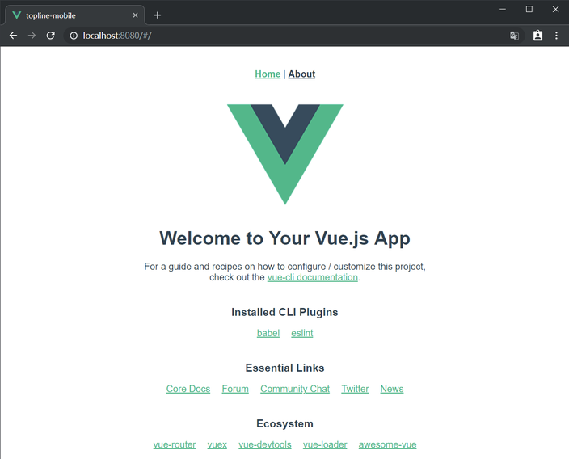

如果能看到该页面，恭喜你，项目创建成功了。

## 加入 Git 版本管理

几个好处：

- 代码备份
- 多人协作
- 历史记录
- ...

（1）创建远程仓库

- [GitHub](https://github.com/lipengzhou)
- [码云](https://gitee.com/)
- [Coding](https://coding.net/)
- ...

（2）将本地仓库推到线上

如果没有本地仓库。

```shell
# 创建本地仓库
git init

# 将文件添加到暂存区
git add 文件

# 提交历史记录
git commit "提交日志"

# 添加远端仓库地址
git remote add origin 你的远程仓库地址

# 推送提交
git push -u origin master
```

如果已有本地仓库（Vue CLI 已经帮我们初始化好了）。

```shell
# 添加远端仓库地址
git remote add origin 你的远程仓库地址

# 推送提交
git push -u origin master
```

如果之后项目代码有了变动需要提交：

```shell
git add
git commit
git push
```

## 调整初始目录结构

默认生成的目录结构不满足我们的开发需求，所以这里需要做一些自定义改动。

这里主要就是下面的两个工作：

- 删除初始化的默认文件
- 新增调整我们需要的目录结构

1、将 `App.vue` 修改为

```html
<template>
  <div id="app">
    <h1>黑马头条</h1>
    <router-view />
  </div>
</template>

<script>
  export default {
    name: "App",
  };
</script>

<style scoped lang="less"></style>
```

2、将 `router/index.js` 修改为

```javascript
import Vue from "vue";
import VueRouter from "vue-router";

Vue.use(VueRouter);

const routes = [];

const router = new VueRouter({
  routes,
});

export default router;
```

3、删除

- src/views/About.vue
- src/views/Home.vue
- src/components/HelloWorld.vue
- src/assets/logo.png

4、创建以下几个目录

- src/api 目录
  - 存储接口封装
- src/utils 目录
  - 存储一些工具模块
- src/styles 目录
  - index.less 文件，存储全局样式
  - 在 `main.js` 中加载全局样式 `import './styles/index.less'`

调整之后的目录结构如下。

```
.
├── README.md
├── babel.config.js
├── package-lock.json
├── package.json
├── public
│   ├── favicon.ico
│   └── index.html
└── src
    ├── api
    ├── App.vue
    ├── assets
    ├── components
    ├── main.js
    ├── router
    ├── utils
    ├── styles
    ├── store
    └── views
```

## 导入图标素材

设计师为我们单独提供了设计稿中的图标，为了方便使用，我们在这里把它制作为字体图标。

制作字体图标的工具有很多，在这里我们推荐大家使用：https://www.iconfont.cn/。

一、注册账户


> 直接选择第三方登录即可

二、创建项目


三、上传图标到项目


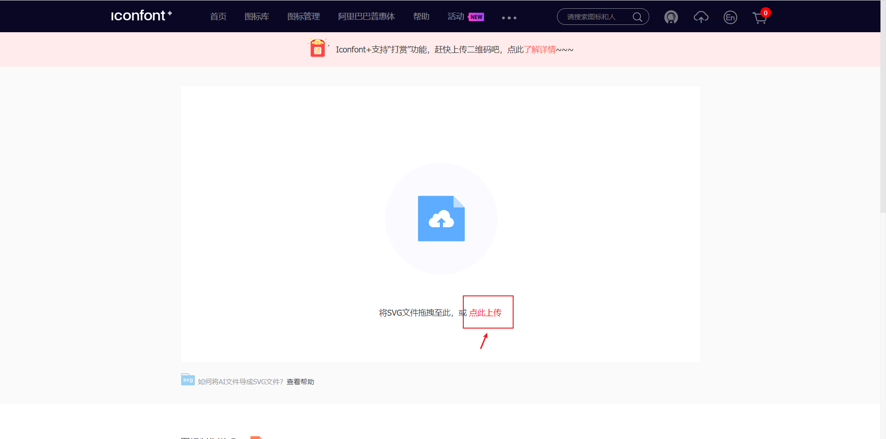


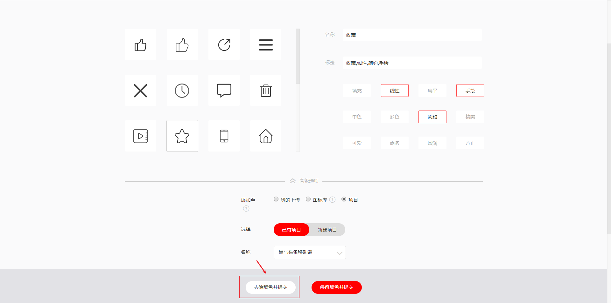


四、生成链接

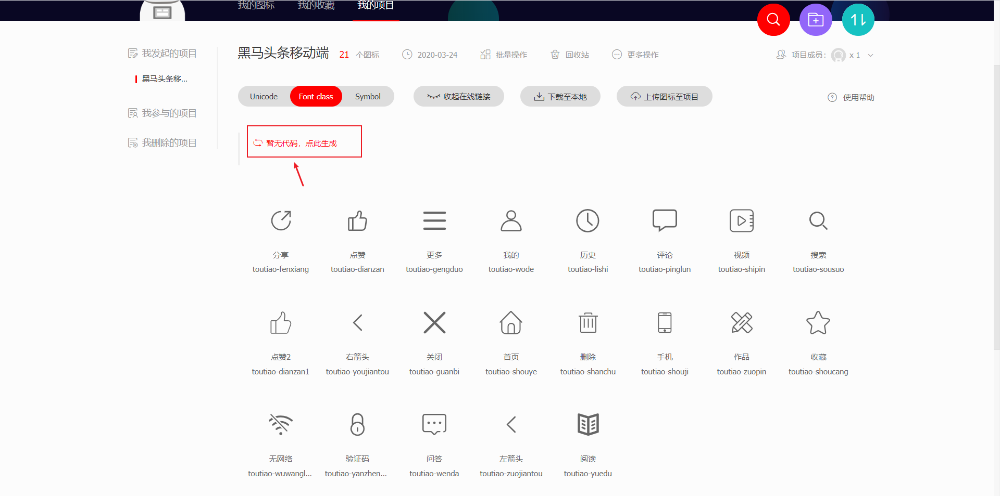

五、配置到项目中使用

一种方式是[将 SVG 图标 包装为 Vue 组件来使用](https://cn.vuejs.org/v2/cookbook/editable-svg-icons.html)。

一种方式是将 SVG 制作为字体图标来使用：

## 引入 Vant 组件库


Vant 是有赞商城前端开发团队开发的一个基于 Vue.js 的移动端组件库，它提供了非常丰富的移动端功能组件，简单易用。

- [官方文档](https://youzan.github.io/vant/#/zh-CN/)
- [GitHub 仓库](https://github.com/youzan/vant)

下面是在 Vant 官网中列出的一些优点：

- 60+ 高质量组件
- 90% 单元测试覆盖率
- 完善的中英文文档和示例
- 支持按需引入
- 支持主题定制
- 支持国际化
- 支持 TS
- 支持 SSR

在我们的项目中主要使用 Vant 作为核心组件库，下面我们根据[官方文档](https://youzan.github.io/vant/#/zh-CN/quickstart#yin-ru-zu-jian)将 Vant 导入项目中。

将 Vant 引入项目一共有四种方式：

- 方式一：自动按需引入组件

  - 和方式二一样，都是按需引入，但是加载更方便一些（需要额外配置插件）
  - 优点：打包体积小
  - 缺点：每个组件在使用之前都需要手动加载注册

- 方式二：手动按需引入组件

  - 在不使用插件的情况下，可以手动引入需要的组件
  - 优点：打包体积小
  - 缺点：每个组件在使用之前都需要手动加载注册

- 方式三：导入所有组件

  - Vant 支持一次性导入所有组件，引入所有组件会增加代码包体积，因此不推荐这种做法
  - 优点：导入一次，使用所有
  - 缺点：打包体积大

- 方式四：通过 CDN 引入
  - 使用 Vant 最简单的方法是直接在 html 文件中引入 CDN 链接，之后你可以通过全局变量`vant`访问到所有组件。
  - 优点：适合一些演示、示例项目，一个 html 文件就可以跑起来
  - 缺点：不适合在模块化系统中使用

这里建议为了前期开发的便利性我们选择方式三：导入所有组件，在最后做打包优化的时候根据需求配置按需加载以降低打包体积大小。

1、安装 Vant

```shell
npm i vant
```

2、在 `main.js` 中加载注册 Vant 组件

```javascript
import Vue from "vue";
import Vant from "vant";
import "vant/lib/index.css";

Vue.use(Vant);
```

3、查阅文档使用组件

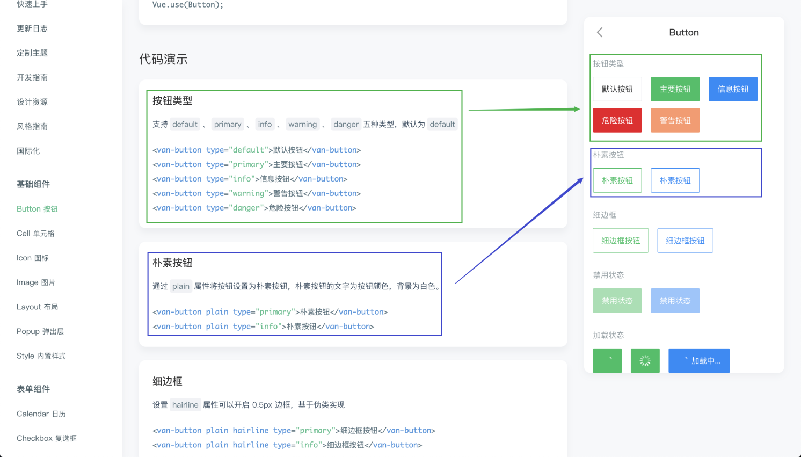

> Vant 的文档非常清晰，左侧是组件目录导航，中间是效果代码，右边是效果预览。

例如我们在根组件使用 Vant 中的组件：

```html
<van-button type="default">默认按钮</van-button>
<van-button type="primary">主要按钮</van-button>
<van-button type="info">信息按钮</van-button>
<van-button type="warning">警告按钮</van-button>
<van-button type="danger">危险按钮</van-button>

<van-cell-group>
  <van-cell title="单元格" value="内容" />
  <van-cell title="单元格" value="内容" label="描述信息" />
</van-cell-group>
```

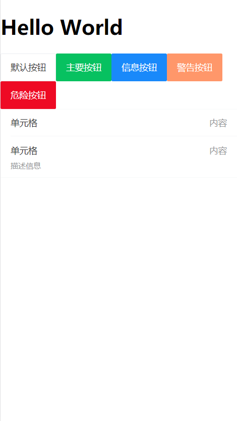

> 如果在页面中能够正常的看到下面的效果，则说明 Vant 导入成功了。

## 移动端 REM 适配

Vant 中的样式默认使用 `px` 作为单位，如果需要使用 `rem` 单位，推荐使用以下两个工具：

- [postcss-pxtorem](https://github.com/cuth/postcss-pxtorem) 是一款 postcss 插件，用于将单位转化为 rem
- [lib-flexible](https://github.com/amfe/lib-flexible) 用于设置 rem 基准值

下面我们分别将这两个工具配置到项目中完成 REM 适配。

**一、使用 [lib-flexible](https://github.com/amfe/lib-flexible) 动态设置 REM 基准值（html 标签的字体大小）**

1、安装

```shell
# yarn add amfe-flexible
npm i amfe-flexible
```

2、然后在 `main.js` 中加载执行该模块

```javascript
import "amfe-flexible";
```

最后测试：在浏览器中切换不同的手机设备尺寸，观察 html 标签 `font-size` 的变化。


> 例如在 iPhone 6/7/8 设备下，html 标签字体大小为 37.5 px


> 例如在 iPhone 6/7/8 Plus 设备下，html 标签字体大小为 41.4 px

**二、使用 [postcss-pxtorem](https://github.com/cuth/postcss-pxtorem) 将 `px` 转为 `rem`**

1、安装

```shell
# yarn add -D postcss-pxtorem
# -D 是 --save-dev 的简写
npm install postcss-pxtorem -D
```

2、然后在**项目根目录**中创建 `.postcssrc.js` 文件

```javascript
module.exports = {
  plugins: {
    autoprefixer: {
      browsers: ["Android >= 4.0", "iOS >= 8"],
    },
    "postcss-pxtorem": {
      rootValue: 37.5,
      propList: ["*"],
    },
  },
};
```

3、**配置完毕，重新启动服务**

最后测试：**刷新浏览器页面**，审查元素的样式查看是否已将 `px` 转换为 `rem`。

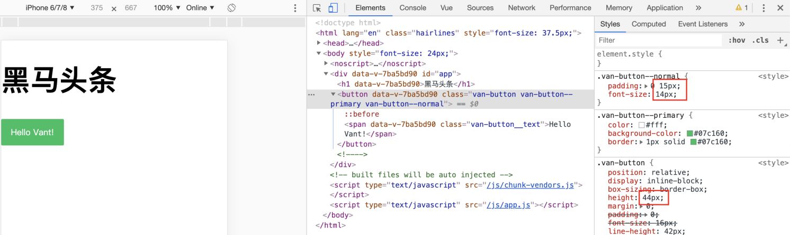

> 这是没有配置转换之前的。

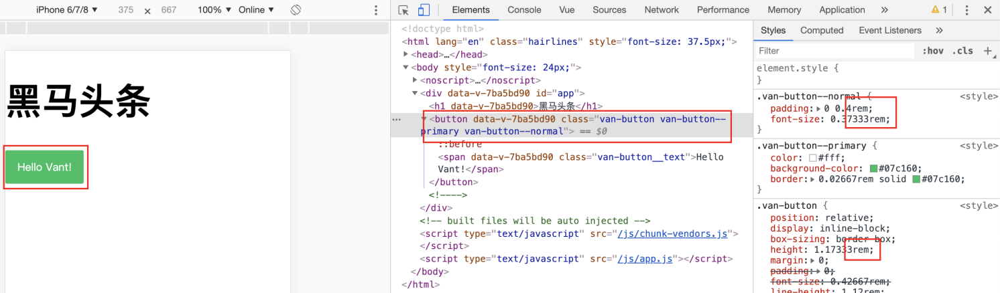

> 这是转换之后的，可以看到 px 都被转换为了 rem。

**需要注意的是：**

- 该插件**不能转换行内样式中的 `px`**，例如 `<div style="width: 200px;"></div>`

## 关于 `.postcssrc.js` 配置文件

```js
module.exports = {
  plugins: {
    autoprefixer: {
      browsers: ["Android >= 4.0", "iOS >= 8"],
    },
    "postcss-pxtorem": {
      rootValue: 37.5,
      propList: ["*"],
    },
  },
};
```

`.postcssrc.js` 是 PostCSS 的配置文件。

（1）PostCSS 介绍

[PostCSS](https://postcss.org/) 是一个处理 CSS 的处理工具，本身功能比较单一，它主要负责解析 CSS 代码，再交由插件来进行处理，它的插件体系非常强大，所能进行的操作是多种多样的，例如：

- [Autoprefixer](https://github.com/postcss/autoprefixer) 插件可以实现自动添加浏览器相关的声明前缀
- [PostCSS Preset Env](https://github.com/csstools/postcss-preset-env) 插件可以让你使用更新的 CSS 语法特性并实现向下兼容
- [postcss-pxtorem](https://github.com/cuth/postcss-pxtorem) 可以实现将 px 转换为 rem
- ...

目前 PostCSS 已经有 [200 多个功能各异的插件](https://github.com/postcss/postcss/blob/master/docs/plugins.md)。开发人员也可以根据项目的需要，开发出自己的 PostCSS 插件。

PostCSS 一般不单独使用，而是与已有的构建工具进行集成。

[Vue CLI 默认集成了 PostCSS](https://cli.vuejs.org/zh/guide/css.html#postcss)，并且默认开启了 [autoprefixer](https://github.com/postcss/autoprefixer) 插件。

> Vue CLI 内部使用了 PostCSS。
>
> 你可以通过 `.postcssrc` 或任何 [postcss-load-config](https://github.com/michael-ciniawsky/postcss-load-config) 支持的配置源来配置 PostCSS。也可以通过 `vue.config.js` 中的 `css.loaderOptions.postcss` 配置 [postcss-loader](https://github.com/postcss/postcss-loader)。
>
> 我们默认开启了 [autoprefixer](https://github.com/postcss/autoprefixer)。如果要配置目标浏览器，可使用 `package.json` 的 [browserslist](https://cli.vuejs.org/zh/guide/browser-compatibility.html#browserslist) 字段。

（2）Autoprefixer 插件的配置


[autoprefixer](https://github.com/postcss/autoprefixer) 是一个自动添加浏览器前缀的 PostCss 插件，`browsers` 用来配置兼容的浏览器版本信息，但是写在这里的话会引起编译器警告。

```
Replace Autoprefixer browsers option to Browserslist config.
Use browserslist key in package.json or .browserslistrc file.

Using browsers option can cause errors. Browserslist config
can be used for Babel, Autoprefixer, postcss-normalize and other tools.

If you really need to use option, rename it to overrideBrowserslist.

Learn more at:
https://github.com/browserslist/browserslist#readme
https://twitter.com/browserslist
```

警告意思就是说你应该将 `browsers` 选项写到 `package.json` 或 `.browserlistrc` 文件中。

```
[Android]
>= 4.0

[iOS]
>= 8

```

> 具体语法请[参考这里](https://github.com/browserslist/browserslist)。

（3）postcss-pxtorem 插件的配置


- `rootValue`：表示根元素字体大小，它会根据根元素大小进行单位转换
- `propList` 用来设定可以从 px 转为 rem 的属性
  - 例如 `*` 就是所有属性都要转换，`width` 就是仅转换 `width` 属性

`rootValue` 应该如何设置呢？

```
如果你使用的是基于 lib-flexable 的 REM 适配方案，则应该设置为你的设计稿的十分之一。
例如设计稿是 750 宽，则应该设置为 75。
```

大多数设计稿的原型都是以 iphone6 为原型，iphone6 设备的宽是 750，我们的设计稿也是这样。

但是 Vant 建议设置为 37.5，为什么呢？

```
因为 Vant 是基于 375 写的，所以如果你设置为 75 的话，Vant 的样式就小了一半。
```

所以如果设置为 `37.5` 的话，Vant 的样式是没有问题的，但是我们在测量设计稿的时候都必须除 2 才能使用，否则就会变得很大。

这样做其实也没有问题，但是有没有更好的办法呢？我就想实现测量多少写多少（不用换算）。于是聪明的你就想，可以不可以这样来做？

- 如果是 Vant 的样式，就把 `rootValue` 设置为 37.5 来转换
- 如果是我们的样式，就按照 75 的 `rootValue` 来转换

通过[查阅文档](https://github.com/cuth/postcss-pxtorem#options)我们可以看到 `rootValue` 支持两种参数类型：

- 数字：固定值
- 函数：动态计算返回
  - postcss-pxtorem 处理每个 CSS 文件的时候都会来调用这个函数
  - 它会把被处理的 CSS 文件相关的信息通过参数传递给该函数

所以我们修改配置如下：

```js
/**
 * PostCSS 配置文件
 */

module.exports = {
  // 配置要使用的 PostCSS 插件
  plugins: {
    // 配置使用 autoprefixer 插件
    // 作用：生成浏览器 CSS 样式规则前缀
    // VueCLI 内部已经配置了 autoprefixer 插件
    // 所以又配置了一次，所以产生冲突了
    // 'autoprefixer': { // autoprefixer 插件的配置
    //   // 配置要兼容到的环境信息
    //   browsers: ['Android >= 4.0', 'iOS >= 8']
    // },

    // 配置使用 postcss-pxtorem 插件
    // 作用：把 px 转为 rem
    "postcss-pxtorem": {
      rootValue({ file }) {
        return file.indexOf("vant") !== -1 ? 37.5 : 75;
      },
      propList: ["*"],
    },
  },
};
```

配置完毕，把服务重启一下，最后测试，very good。

## 封装请求模块

和之前项目一样，这里我们还是使用 [axios](https://github.com/axios/axios) 作为我们项目中的请求库，为了方便使用，我们把它封装为一个请求模块，在需要的时候直接加载即可。

1、安装 axios

```shell
npm i axios
```

2、创建 `src/utils/request.js`

```javascript
/**
 * 封装 axios 请求模块
 */
import axios from "axios";

const request = axios.create({
  baseURL: "http://ttapi.research.itcast.cn/", // 基础路径
});

export default request;
```

3、如何使用

- 方式一（简单方便，但是不利于接口维护）：我们可以把请求对象挂载到 `Vue.prototype` 原型对象中，然后在组件中通过 `this.xxx` 直接访问
- 方式二（推荐）：我们把每一个请求都封装成每个独立的功能函数，在需要的时候加载调用，这种做法更便于接口的管理和维护

在我们的项目中建议使用方式二，更推荐（在随后的业务功能中我们就能学到）。

# 二、登录注册

> 目标
>
> - 能实现登录页面的布局
> - 能实现基本登录功能
> - 能掌握 Vant 中 Toast 提示组件的使用
> - 能理解 API 请求模块的封装
> - 能理解发送验证码的实现思路
> - 能理解 Vant Form 实现表单验证的使用

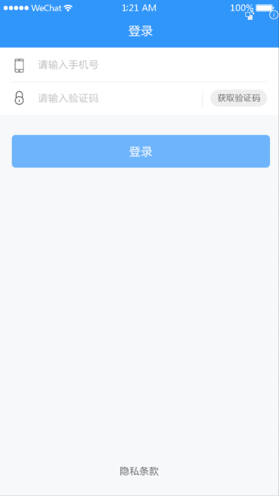

## 准备

### 创建组件并配置路由

1、创建 `src/views/login/index.vue` 并写入以下内容

```html
<template>
  <div class="login-container">登录页面</div>
</template>

<script>
  export default {
    name: "LoginPage",
    components: {},
    props: {},
    data() {
      return {};
    },
    computed: {},
    watch: {},
    created() {},
    mounted() {},
    methods: {},
  };
</script>

<style scoped lang="less"></style>
```

2、然后在 `src/router/index.js` 中配置登录页的路由表

```javascript
{
  path: '/login',
  name: 'login',
  component: () => import('@/views/login')
}
```

最后，访问 `/login` 查看是否能访问到登录页面。

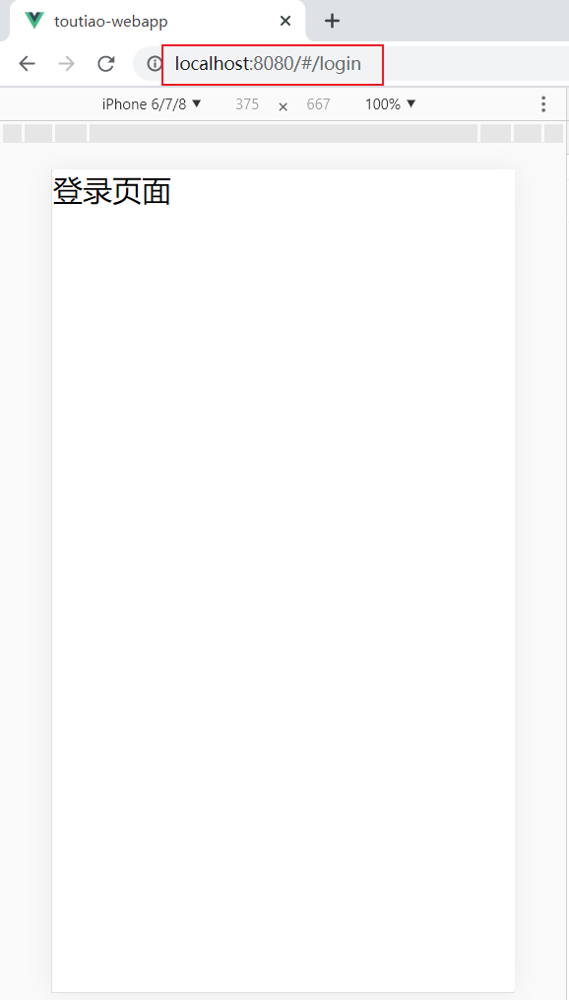

### 布局结构

这里主要使用到三个 Vant 组件：

- [NavBar 导航栏](https://youzan.github.io/vant/#/zh-CN/nav-bar)
- [Form 表单](https://youzan.github.io/vant/#/zh-CN/form)
  - [Field 输入框](https://youzan.github.io/vant/#/zh-CN/field)
  - [Button 按钮](https://youzan.github.io/vant/#/zh-CN/button)

> 一个经验：使用组件库中的现有组件快速布局，再慢慢调整细节，效率更高（刚开始可能会感觉有点麻烦，越用越熟，慢慢的就有了自己的思想）。

### 布局样式

> 写样式的原则：将公共样式写到全局（`src/styles/index.less`），将局部样式写到组件内部。

1、`src/styles/index.less`

```less
body {
  background-color: #f5f7f9;
}

.page-nav-bar {
  background-color: #3296fa;
  .van-nav-bar__title {
    color: #fff;
  }
}
```

2、`src/views/login/index.vue`

```html
<template>
  <div class="login-container">
    <!-- 导航栏 -->
    <van-nav-bar class="page-nav-bar" title="登录" />
    <!-- /导航栏 -->

    <!-- 登录表单 -->
    <van-form @submit="onSubmit">
      <van-field name="用户名" placeholder="请输入手机号">
        <i slot="left-icon" class="toutiao toutiao-shouji"></i>
      </van-field>
      <van-field type="password" name="验证码" placeholder="请输入验证码">
        <i slot="left-icon" class="toutiao toutiao-yanzhengma"></i>
        <template #button>
          <van-button class="send-sms-btn" round size="small" type="default"
            >发送验证码</van-button
          >
        </template>
      </van-field>
      <div class="login-btn-wrap">
        <van-button class="login-btn" block type="info" native-type="submit">
          登录
        </van-button>
      </div>
    </van-form>
    <!-- /登录表单 -->
  </div>
</template>

<script>
  export default {
    name: "LoginIndex",
    components: {},
    props: {},
    data() {
      return {};
    },
    computed: {},
    watch: {},
    created() {},
    mounted() {},
    methods: {
      onSubmit(values) {
        console.log("submit", values);
      },
    },
  };
</script>

<style scoped lang="less">
  .login-container {
    .toutiao {
      font-size: 37px;
    }
    .send-sms-btn {
      width: 152px;
      height: 46px;
      line-height: 46px;
      background-color: #ededed;
      font-size: 22px;
      color: #666;
    }
    .login-btn-wrap {
      padding: 53px 33px;
      .login-btn {
        background-color: #6db4fb;
        border: none;
      }
    }
  }
</style>
```

## 实现基本登录功能

思路：

- 注册点击登录的事件
- 获取表单数据（根据接口要求使用 v-model 绑定）
- 表单验证
- 发请求提交
- 根据请求结果做下一步处理

**一、根据接口要求绑定获取表单数据**

1、在登录页面组件的实例选项 data 中添加 `user` 数据字段

```javascript
...
data () {
  return {
    user: {
      mobile: '',
      code: ''
    }
  }
}
```

2、在表单中使用 `v-model` 绑定对应数据

```html
<!-- van-cell-group 仅仅是提供了一个上下外边框，能看到包裹的区域 -->
<van-cell-group>
  <van-field
    v-model="user.mobile"
    required
    clearable
    label="手机号"
    placeholder="请输入手机号"
  />

  <van-field
    v-model="user.code"
    type="number"
    label="验证码"
    placeholder="请输入验证码"
    required
  />
</van-cell-group>
```

最后测试。

> 一个小技巧：使用 VueDevtools 调试工具查看是否绑定成功。

**二、请求登录**

1、创建 `src/api/user.js` 封装请求方法

```js
/**
 * 用户相关的请求模块
 */
import request from "@/utils/request";

/**
 * 用户登录
 */
export const login = (data) => {
  return request({
    method: "POST",
    url: "/app/v1_0/authorizations",
    data,
  });
};
```

2、给登录按钮注册点击事件

```javascript
async onLogin () {
  try {
    const res = await login(this.user)
    console.log('登录成功', res)
  } catch (err) {
    if (err.response.status === 400) {
     	console.log('登录失败', err)
    }
  }
}
```

最后测试。

## 登录状态提示

Vant 中内置了[Toast 轻提示](https://youzan.github.io/vant/#/zh-CN/toast)组件，可以实现移动端常见的提示效果。

```javascript
// 简单文字提示
Toast("提示内容");

// loading 转圈圈提示
Toast.loading({
  duration: 0, // 持续展示 toast
  message: "加载中...",
  forbidClick: true, // 是否禁止背景点击
});

// 成功提示
Ttoast.success("成功文案");

// 失败提示
Toast.fail("失败文案");
```

> 提示：在组件中可以直接通过 `this.$toast` 调用。

另外需要注意的是：Toast 默认采用单例模式，即同一时间只会存在一个 Toast，如果需要在同一时间弹出多个 Toast，可以参考下面的示例

```javascript
Toast.allowMultiple();

const toast1 = Toast("第一个 Toast");
const toast2 = Toast.success("第二个 Toast");

toast1.clear();
toast2.clear();
```

下面是为我们的登录功能增加 toast 交互提示。

```javascript
async onLogin () {
  // 开始转圈圈
  this.$toast.loading({
    duration: 0, // 持续时间，0表示持续展示不停止
    forbidClick: true, // 是否禁止背景点击
    message: '登录中...' // 提示消息
  })

  try {
    const res = await request({
      method: 'POST',
      url: '/app/v1_0/authorizations',
      data: this.user
    })
    console.log('登录成功', res)
    // 提示 success 或者 fail 的时候，会先把其它的 toast 先清除
    this.$toast.success('登录成功')
  } catch (err) {
    console.log('登录失败', err)
    this.$toast.fail('登录失败，手机号或验证码错误')
  }
}
```

假如请求非常快的话就看不到 loading 效果了，这里可以手动将调试工具中的网络设置为慢速网络。

测试结束，再把网络设置恢复为 `Online` 正常网络。

## 表单验证

> 参考文档：[Form 表单验证](https://youzan.github.io/vant/#/zh-CN/form#xiao-yan-gui-ze)

```html
<template>
  <div class="login-container">
    <!-- 导航栏 -->
    <van-nav-bar class="page-nav-bar" title="登录" />
    <!-- /导航栏 -->

    <!-- 登录表单 -->
    <!--
      表单验证：
        1、给 van-field 组件配置 rules 验证规则
          参考文档：https://youzan.github.io/vant/#/zh-CN/form#rule-shu-ju-jie-gou
        2、当表单提交的时候会自动触发表单验证
           如果验证通过，会触发 submit 事件
           如果验证失败，不会触发 submit
     -->
    <van-form @submit="onSubmit">
      <van-field
        v-model="user.mobile"
        name="手机号"
        placeholder="请输入手机号"
        :rules="userFormRules.mobile"
        type="number"
        maxlength="11"
      >
        <i slot="left-icon" class="toutiao toutiao-shouji"></i>
      </van-field>
      <van-field
        v-model="user.code"
        name="验证码"
        placeholder="请输入验证码"
        :rules="userFormRules.code"
        type="number"
        maxlength="6"
      >
        <i slot="left-icon" class="toutiao toutiao-yanzhengma"></i>
        <template #button>
          <van-button class="send-sms-btn" round size="small" type="default"
            >发送验证码</van-button
          >
        </template>
      </van-field>
      <div class="login-btn-wrap">
        <van-button class="login-btn" block type="info" native-type="submit">
          登录
        </van-button>
      </div>
    </van-form>
    <!-- /登录表单 -->
  </div>
</template>

<script>
  import { login } from "@/api/user";

  export default {
    name: "LoginIndex",
    components: {},
    props: {},
    data() {
      return {
        user: {
          mobile: "", // 手机号
          code: "", // 验证码
        },
        userFormRules: {
          mobile: [
            {
              required: true,
              message: "手机号不能为空",
            },
            {
              pattern: /^1[3|5|7|8]\d{9}$/,
              message: "手机号格式错误",
            },
          ],
          code: [
            {
              required: true,
              message: "验证码不能为空",
            },
            {
              pattern: /^\d{6}$/,
              message: "验证码格式错误",
            },
          ],
        },
      };
    },
    computed: {},
    watch: {},
    created() {},
    mounted() {},
    methods: {
      async onSubmit() {
        // 1. 获取表单数据
        const user = this.user;

        // TODO: 2. 表单验证

        // 3. 提交表单请求登录
        this.$toast.loading({
          message: "登录中...",
          forbidClick: true, // 禁用背景点击
          duration: 0, // 持续时间，默认 2000，0 表示持续展示不关闭
        });

        try {
          const res = await login(user);
          console.log("登录成功", res);
          this.$toast.success("登录成功");
        } catch (err) {
          if (err.response.status === 400) {
            this.$toast.fail("手机号或验证码错误");
          } else {
            this.$toast.fail("登录失败，请稍后重试");
          }
        }

        // 4. 根据请求响应结果处理后续操作
      },
    },
  };
</script>

<style scoped lang="less">
  .login-container {
    .toutiao {
      font-size: 37px;
    }

    .send-sms-btn {
      width: 152px;
      height: 46px;
      line-height: 46px;
      background-color: #ededed;
      font-size: 22px;
      color: #666;
    }

    .login-btn-wrap {
      padding: 53px 33px;
      .login-btn {
        background-color: #6db4fb;
        border: none;
      }
    }
  }
</style>
```

## 验证码处理

### 验证手机号

```js
async onSendSms () {
  console.log('onSendSms')
  // 1. 校验手机号
  try {
    await this.$refs.loginForm.validate('mobile')
  } catch (err) {
    return console.log('验证失败', err)
  }

  // 2. 验证通过，显示倒计时
  // 3. 请求发送验证码
}
```

### 使用倒计时组件

1、在 data 中添加数据用来控制倒计时的显示和隐藏

```javascript
data () {
  return {
    ...
    isCountDownShow: false
  }
}
```

2、使用倒计时组件

```html
<van-field v-model="user.code" placeholder="请输入验证码">
  <i class="icon icon-mima" slot="left-icon"></i>
  <van-count-down
    v-if="isCountDownShow"
    slot="button"
    :time="1000 * 5"
    format="ss s"
    @finish="isCountDownShow = false"
  />
  <van-button
    v-else
    slot="button"
    size="small"
    type="primary"
    round
    @click="onSendSmsCode"
    >发送验证码</van-button
  >
</van-field>
```

### 发送验证码

1、在 `api/user.js` 中添加封装数据接口

```javascript
export const getSmsCode = (mobile) => {
  return request({
    method: "GET",
    url: `/app/v1_0/sms/codes/${mobile}`,
  });
};
```

2、给发送验证码按钮注册点击事件

3、发送处理

```javascript
async onSendSms () {
  // 1. 校验手机号
  try {
    await this.$refs.loginForm.validate('mobile')
  } catch (err) {
    return console.log('验证失败', err)
  }

  // 2. 验证通过，显示倒计时
  this.isCountDownShow = true

  // 3. 请求发送验证码
  try {
    await sendSms(this.user.mobile)
    this.$toast('发送成功')
  } catch (err) {
    // 发送失败，关闭倒计时
    this.isCountDownShow = false
    if (err.response.status === 429) {
      this.$toast('发送太频繁了，请稍后重试')
    } else {
      this.$toast('发送失败，请稍后重试')
    }
  }
}
```

## 处理用户 Token


Token 是用户登录成功之后服务端返回的一个身份令牌，在项目中的多个业务中需要使用到：

- 访问需要授权的 API 接口
- 校验页面的访问权限
- ...

但是我们只有在第一次用户登录成功之后才能拿到 Token。

所以为了能在其它模块中获取到 Token 数据，我们需要把它存储到一个公共的位置，方便随时取用。

往哪儿存？

- 本地存储
  - 获取麻烦
  - 数据不是响应式
- Vuex 容器（推荐）
  - 获取方便
  - 响应式的

使用容器存储 Token 的思路：


- 登录成功，将 Token 存储到 Vuex 容器中
  - 获取方便
  - 响应式
- 为了持久化，还需要把 Token 放到本地存储
  - 持久化

下面是具体实现。

1、在 `src/store/index.js` 中

```js
import Vue from "vue";
import Vuex from "vuex";

Vue.use(Vuex);

export default new Vuex.Store({
  state: {
    // 用户的登录状态信息
    user: JSON.parse(window.localStorage.getItem("TOUTIAO_USER")),
    // user: null
  },
  mutations: {
    setUser(state, user) {
      state.user = user;
      window.localStorage.setItem("TOUTIAO_USER", JSON.stringify(user));
    },
  },
  actions: {},
  modules: {},
});
```

2、登录成功以后将后端返回的 token 相关数据存储到容器中

```js
async onLogin () {
  // const loginToast = this.$toast.loading({
  this.$toast.loading({
    duration: 0, // 持续时间，0表示持续展示不停止
    forbidClick: true, // 是否禁止背景点击
    message: '登录中...' // 提示消息
  })

  try {
    const res = await login(this.user)

    // res.data.data => { token: 'xxx', refresh_token: 'xxx' }
+    this.$store.commit('setUser', res.data.data)

    // 提示 success 或者 fail 的时候，会先把其它的 toast 先清除
    this.$toast.success('登录成功')
  } catch (err) {
    console.log('登录失败', err)
    this.$toast.fail('登录失败，手机号或验证码错误')
  }

  // 停止 loading，它会把当前页面中所有的 toast 都给清除
  // loginToast.clear()
}
```

## 优化封装本地存储操作模块

创建 `src/utils/storage.js` 模块。

```js
export const getItem = (name) => {
  const data = window.localStorage.getItem(name);
  try {
    return JSON.parse(data);
  } catch (err) {
    return data;
  }
};

export const setItem = (name, value) => {
  if (typeof value === "object") {
    value = JSON.stringify(value);
  }
  window.localStorage.setItem(name, value);
};

export const removeItem = (name) => {
  window.localStorage.removeItem(name);
};
```

## 关于 Token 过期问题

登录成功之后后端会返回两个 Token：

- `token`：访问令牌，有效期 2 小时
- `refresh_token`：刷新令牌，有效期 14 天，用于访问令牌过期之后重新获取新的访问令牌

我们的项目接口中设定的 `Token` 有效期是 `2 小时`，超过有效期服务端会返回 `401` 表示 Token 无效或过期了。

为什么过期时间这么短？

- 为了安全，例如 Token 被别人盗用

过期了怎么办？

- ~~让用户重新登录~~，用户体验太差了
- 使用 `refresh_token` 解决 `token` 过期

如何使用 `refresh_token` 解决 `token` 过期？

> 到课程的后面我们开发的业务功能丰富起来之后，再给大家讲解 Token 过期处理。
>
> 大家需要注意的是**在学习测试的时候如果收到 401 响应码，请重新登录再测试**。


概述：服务器生成 token 的过程中，会有两个时间，一个是 token 失效时间，一个是 token 刷新时间，刷新时间肯定比失效时间长，当用户的 `token` 过期时，你可以拿着过期的 token 去换取新的 token，来保持用户的登陆状态，当然你这个过期 token 的过期时间必须在刷新时间之内，如果超出了刷新时间，那么返回的依旧是 401。

处理流程：

1. 在 axios 的拦截器中加入 token 刷新逻辑
2. 当用户 token 过期时，去向服务器请求新的 token
3. 把旧的 token 替换为新的 token
4. 然后继续用户当前的请求

在请求的响应拦截器中统一处理 token 过期：

```js
/**
 * 封装 axios 请求模块
 */
import axios from "axios";
import jsonBig from "json-bigint";
import store from "@/store";
import router from "@/router";

// axios.create 方法：复制一个 axios
const request = axios.create({
  baseURL: "http://ttapi.research.itcast.cn/", // 基础路径
});

/**
 * 配置处理后端返回数据中超出 js 安全整数范围问题
 */
request.defaults.transformResponse = [
  function (data) {
    try {
      return jsonBig.parse(data);
    } catch (err) {
      return {};
    }
  },
];

// 请求拦截器
request.interceptors.request.use(
  function (config) {
    const user = store.state.user;
    if (user) {
      config.headers.Authorization = `Bearer ${user.token}`;
    }
    // Do something before request is sent
    return config;
  },
  function (error) {
    // Do something with request error
    return Promise.reject(error);
  }
);

// 响应拦截器
request.interceptors.response.use(
  // 响应成功进入第1个函数
  // 该函数的参数是响应对象
  function (response) {
    // Any status code that lie within the range of 2xx cause this function to trigger
    // Do something with response data
    return response;
  },
  // 响应失败进入第2个函数，该函数的参数是错误对象
  async function (error) {
    // Any status codes that falls outside the range of 2xx cause this function to trigger
    // Do something with response error
    // 如果响应码是 401 ，则请求获取新的 token

    // 响应拦截器中的 error 就是那个响应的错误对象
    console.dir(error);
    if (error.response && error.response.status === 401) {
      // 校验是否有 refresh_token
      const user = store.state.user;

      if (!user || !user.refresh_token) {
        router.push("/login");

        // 代码不要往后执行了
        return;
      }

      // 如果有refresh_token，则请求获取新的 token
      try {
        const res = await axios({
          method: "PUT",
          url: "http://ttapi.research.itcast.cn/app/v1_0/authorizations",
          headers: {
            Authorization: `Bearer ${user.refresh_token}`,
          },
        });

        // 如果获取成功，则把新的 token 更新到容器中
        console.log("刷新 token  成功", res);
        store.commit("setUser", {
          token: res.data.data.token, // 最新获取的可用 token
          refresh_token: user.refresh_token, // 还是原来的 refresh_token
        });

        // 把之前失败的用户请求继续发出去
        // config 是一个对象，其中包含本次失败请求相关的那些配置信息，例如 url、method 都有
        // return 把 request 的请求结果继续返回给发请求的具体位置
        return request(error.config);
      } catch (err) {
        // 如果获取失败，直接跳转 登录页
        console.log("请求刷线 token 失败", err);
        router.push("/login");
      }
    }

    return Promise.reject(error);
  }
);

export default request;
```

# 三、个人中心


## TabBar 处理

通过分析页面，我们可以看到，首页、问答、视频、我的 都使用的是同一个底部标签栏，我们没必要在每个页面中都写一个，所以为了通用方便，我们可以使用 Vue Router 的嵌套路由来处理。

- 父路由：一个空页面，包含一个 tabbar，中间留子路由出口
- 子路由
  - 首页
  - 问答
  - 视频
  - 我的

一、创建 tabbar 组件并配置路由


这里主要使用到的 Vant 组件：

- [Tabbar 标签栏](https://youzan.github.io/vant/#/zh-CN/tabbar)

1、创建 `src/views/layout/index.vue`

```html
<template>
  <div class="layout-container">
    <!-- 子路由出口 -->
    <router-view />
    <!-- /子路由出口 -->

    <!-- 标签导航栏 -->
    <!--
      route: 开启路由模式
     -->
    <van-tabbar class="layout-tabbar" route>
      <van-tabbar-item to="/">
        <i slot="icon" class="toutiao toutiao-shouye"></i>
        <span class="text">首页</span>
      </van-tabbar-item>
      <van-tabbar-item to="/qa">
        <i slot="icon" class="toutiao toutiao-wenda"></i>
        <span class="text">问答</span>
      </van-tabbar-item>
      <van-tabbar-item to="/video">
        <i slot="icon" class="toutiao toutiao-shipin"></i>
        <span class="text">视频</span>
      </van-tabbar-item>
      <van-tabbar-item to="/my">
        <i slot="icon" class="toutiao toutiao-wode"></i>
        <span class="text">我的</span>
      </van-tabbar-item>
    </van-tabbar>
    <!-- /标签导航栏 -->
  </div>
</template>

<script>
  export default {
    name: "LayoutIndex",
    components: {},
    props: {},
    data() {
      return {};
    },
    computed: {},
    watch: {},
    created() {},
    mounted() {},
    methods: {},
  };
</script>

<style scoped lang="less">
  .layout-container {
    .layout-tabbar {
      i.toutiao {
        font-size: 40px;
      }
      span.text {
        font-size: 20px;
      }
    }
  }
</style>
```

2、然后将 layout 组件配置到一级路由

```js
{
  path: '/',
  component: () => import('@/views/layout')
}
```

访问 `/` 测试。

二、分别创建首页、问答、视频、我的页面组件

首页组件：

```html
<template>
  <div class="home-container">首页</div>
</template>

<script>
  export default {
    name: "HomePage",
    components: {},
    props: {},
    data() {
      return {};
    },
    computed: {},
    watch: {},
    created() {},
    mounted() {},
    methods: {},
  };
</script>

<style scoped></style>
```

问答组件：

```html
<template>
  <div class="qa-container">问答</div>
</template>

<script>
  export default {
    name: "QaPage",
    components: {},
    props: {},
    data() {
      return {};
    },
    computed: {},
    watch: {},
    created() {},
    mounted() {},
    methods: {},
  };
</script>

<style scoped></style>
```

视频组件：

```html
<template>
  <div class="video-container">首页</div>
</template>

<script>
  export default {
    name: "VideoPage",
    components: {},
    props: {},
    data() {
      return {};
    },
    computed: {},
    watch: {},
    created() {},
    mounted() {},
    methods: {},
  };
</script>

<style scoped></style>
```

我的组件：

```html
<template>
  <div class="my-container">首页</div>
</template>

<script>
  export default {
    name: "MyPage",
    components: {},
    props: {},
    data() {
      return {};
    },
    computed: {},
    watch: {},
    created() {},
    mounted() {},
    methods: {},
  };
</script>

<style scoped></style>
```

二、将四个主页面配置为 tab-bar 的子路由

```js
{
  path: '/',
  name: 'tab-bar',
  component: () => import('@/views/tab-bar'),
  children: [
    {
      path: '', // 默认子路由
      name: 'home',
      component: () => import('@/views/home')
    },
    {
      path: 'qa',
      name: 'qa',
      component: () => import('@/views/qa')
    },
    {
      path: 'video',
      name: 'video',
      component: () => import('@/views/video')
    },
    {
      path: 'my',
      name: 'my',
      component: () => import('@/views/my')
    }
  ]
}
```

最后测试。

## 页面布局

### 未登录头部状态

```html
<template>
  <div class="my-container">
    <div class="header">
      
    </div>
    <div class="grid-nav"></div>
    <van-cell title="消息通知" is-link url="" />
    <van-cell title="实名认证" is-link url="" />
    <van-cell title="用户反馈" is-link url="" />
    <van-cell title="小智同学" is-link url="" />
    <van-cell title="系统设置" is-link url="" />
  </div>
</template>

<script>
  export default {
    name: "MyIndex",
    components: {},
    props: {},
    data() {
      return {};
    },
    computed: {},
    watch: {},
    created() {},
    mounted() {},
    methods: {},
  };
</script>

<style scoped lang="less">
  .my-container {
    > .header {
      height: 361px;
      background: url("~@/assets/banner.png") no-repeat;
      background-size: cover;
      display: flex;
      justify-content: center;
      align-items: center;
      .mobile-img {
        width: 132px;
        height: 132px;
      }
    }
  }
</style>
```

### 已登录头部

### 宫格导航

### 单元格导航

## 处理已登录和未登录的页面展示

- 未登录，展示登录按钮
- 已登录，展示登录用户信息

```html
<!-- 已登录：用户信息 -->
<div v-if="$store.state.user" class="user-info-wrap">...</div>
<!-- /已登录：用户信息 -->

<!-- 未登录 -->
<div v-else class="not-login" @click="$router.push('/login')">...</div>
<!-- /未登录 -->

<!-- 退出 -->
<van-cell-group v-if="$store.state.user"> ... </van-cell-group>
<!-- /退出 -->
```

## 用户退出


1、给退出按钮注册点击事件

2、退出处理

```js
onLogout () {
  // 退出提示
  // 在组件中需要使用 this.$dialog 来调用弹框组件
  this.$dialog.confirm({
    title: '确认退出吗？'
  }).then(() => {
    // on confirm
    // 确认退出：清除登录状态（容器中的 user + 本地存储中的 user）
    this.$store.commit('setUser', null)
  }).catch(() => {
    // on cancel
    console.log('取消执行这里')
  })
}
```

最后测试。

## 展示登录用户信息

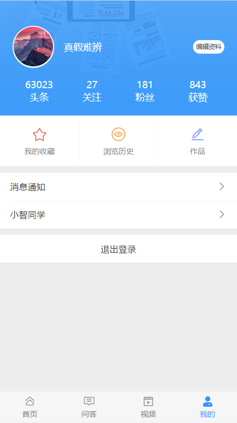

步骤：

- 封装接口
- 请求获取数据
- 模板绑定

1、在 `api/user.js` 中添加封装数据接口

```js
/**
 * 获取用户自己的信息
 */
export const getUserInfo = () => {
  return request({
    method: "GET",
    url: "/app/v1_0/user",
    // 发送请求头数据
    headers: {
      // 注意：该接口需要授权才能访问
      //       token的数据格式：Bearer token数据，注意 Bearer 后面有个空格
      Authorization: `Bearer ${store.state.user.token}`,
    },
  });
};
```

2、在 `views/my/index.vue` 请求加载数据

```js
+ import { getUserInfo } from '@/api/user'

export default {
  name: 'MyPage',
  components: {},
  props: {},
  data () {
    return {
+      userInfo: {} // 用户信息
    }
  },
  computed: {},
  watch: {},
+++  created () {
    // 初始化的时候，如果用户登录了，我才请求获取当前登录用户的信息
    if (this.$store.state.user) {
      this.loadUser()
    }
  },
  mounted () {},
  methods: {
+++    async loadUser () {
      try {
        const { data } = await getUserInfo()
        this.user = data.data
      } catch (err) {
        console.log(err)
        this.$toast('获取数据失败')
      }
    }
  }
}
```

3、模板绑定

## 优化设置 Token

项目中的接口除了登录之外大多数都需要提供 token 才有访问权限。

通过接口文档可以看到，后端接口要求我们将 token 放到请求头 `Header` 中并以下面的格式发送。


> 字段名称：`Authorization`
>
> 字段值：`Bearer token`，注意 `Bearer` 和 `token` 之间有一个空格

方式一：在每次请求的时候手动添加（麻烦）。

```js
axios({
  method: "",
  url: "",
  headers: {
    Authorization: "Bearer token",
  },
});
```

方式二：使用请求拦截器统一添加（推荐，更方便）。

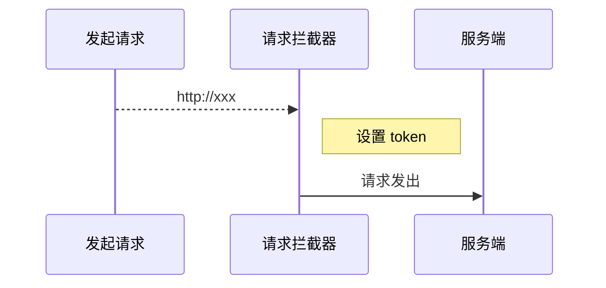
```mermaid
sequenceDiagram
	participant A as 发起请求
	participant B as 请求拦截器
	participant C as 服务端
  A-->>B: http://xxx
  Note right of B: 设置 token
  B->>C: 请求发出


```

在 `src/utils/request.js` 中添加拦截器统一设置 token：

```js
/**
 * 请求模块
 */
import axios from "axios";
import store from "@/store";

const request = axios.create({
  baseURL: "http://ttapi.research.itcast.cn/", // 接口的基准路径
});

// 请求拦截器
// Add a request interceptor
request.interceptors.request.use(
  function (config) {
    // Do something before request is sent
    // config ：本次请求的配置对象
    // config 里面有一个属性：headers
    const { user } = store.state;
    if (user && user.token) {
      config.headers.Authorization = `Bearer ${user.token}`;
    }
    return config;
  },
  function (error) {
    // Do something with request error
    return Promise.reject(error);
  }
);

// 响应拦截器

export default request;
```

# 四、首页—文章列表


## 页面布局

### 头部导航栏

1、使用导航栏组件

2、在导航栏组件中插入按钮

- 文本
- 图标

3、样式调整

- 宽高
- 背景色
- 边框
- 文本大小
- 图标大小

```html
<template>
  <div class="home-container">
    <!-- 导航栏 -->
    <van-nav-bar class="page-nav-bar">
      <van-button
        class="search-btn"
        slot="title"
        type="info"
        size="small"
        round
        icon="search"
        >搜索</van-button
      >
    </van-nav-bar>
    <!-- /导航栏 -->
  </div>
</template>

<script>
  export default {
    name: "HomeIndex",
    components: {},
    props: {},
    data() {
      return {};
    },
    computed: {},
    watch: {},
    created() {},
    mounted() {},
    methods: {},
  };
</script>

<style scoped lang="less">
  .home-container {
    .van-nav-bar__title {
      max-width: unset;
    }
    .search-btn {
      width: 555px;
      height: 64px;
      background-color: #5babfb;
      border: none;
      font-size: 28px;
      .van-icon {
        font-size: 32px;
      }
    }
  }
</style>
```

## 频道列表

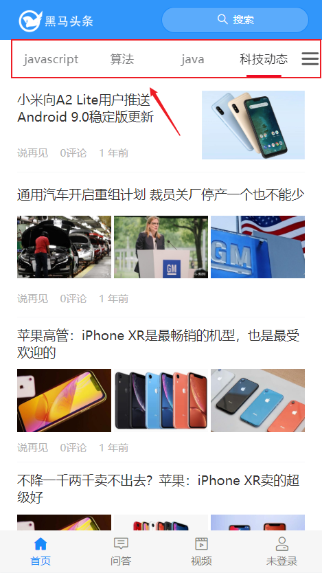

### 使用 Tab 标签页组件

参考：[Tab 标签页组件](https://youzan.github.io/vant/#/zh-CN/tab)

### 样式调整

（1）基础样式调整

- 标签项
  - 右边框
  - 下边框
  - 宽高
  - 文字大小
  - 文字颜色
- 底部条
  - 宽高
  - 颜色
  - 位置

（2）处理汉堡按钮

1、使用插槽插入内容

2、样式调整

- 定位
- 内容居中
- 宽高
- 背景色、透明度
- 字体图标大小

3、使用伪元素设置渐变边框

- 定位
- 宽高
- 背景图
- 背景图填充模式

4、添加占位符充当内容区域

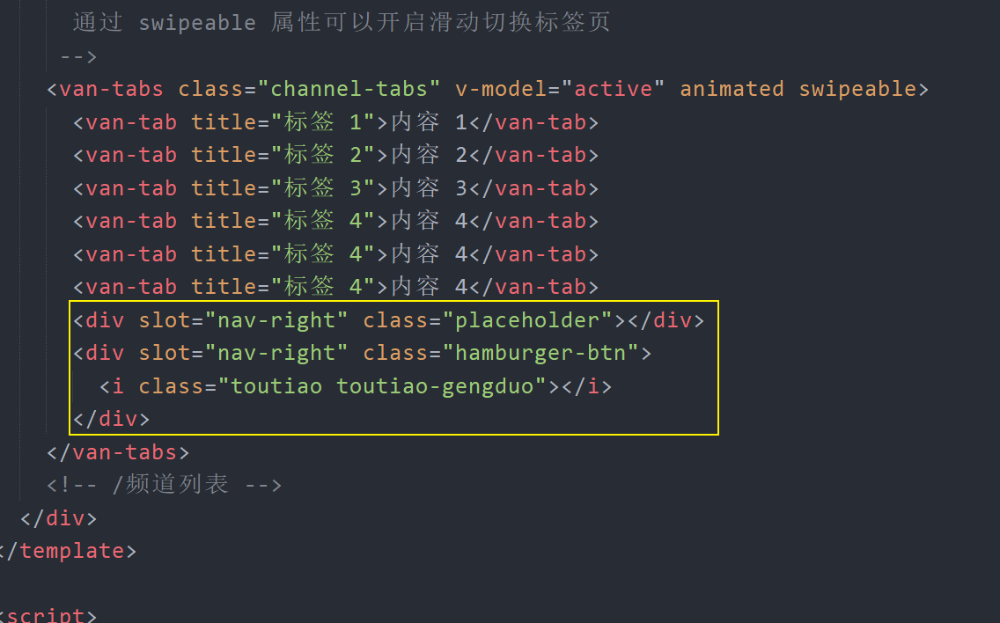

CSS 样式：

```less
.placeholder {
  flex-shrink: 0;
  width: 66px;
  height: 82px;
}

.hamburger-btn {
  position: fixed;
  right: 0;
  display: flex;
  justify-content: center;
  align-items: center;
  width: 66px;
  height: 82px;
  background-color: #fff;
  opacity: 0.902;
  i.toutiao {
    font-size: 33px;
  }
  &:before {
    content: "";
    position: absolute;
    left: 0;
    width: 1px;
    height: 100%;
    background-image: url(~@/assets/gradient-gray-line.png);
    background-size: contain;
  }
}
```

### 展示频道列表

思路：

1. 找数据接口
2. 把接口封装为请求方法
3. 在组件中请求获取数据
4. 模板绑定

1、封装数据请求接口

```js
/**
 * 获取用户自己的信息
 */
export const getUserChannels = () => {
  return request({
    method: "GET",
    url: "/app/v1_0/user/channels",
  });
};
```

2、请求获取数据

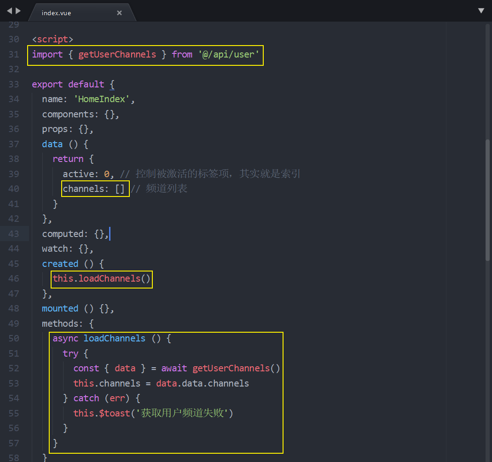

3、模板绑定

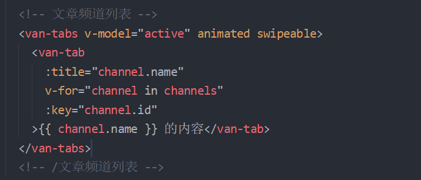

## 文章列表


### 思路分析

你的思路可能是这样的：

1、找到数据接口

2、封装请求方法

3、在组件中请求获取数据，将数据存储到 data 中

4、模板绑定展示

根据不同的频道加载不同的文章列表，你的思路可能是这样的：

- 有一个 `list` 数组，用来存储文章列表
- 查看 `a` 频道：请求获取数据，让 `list = a` 频道文章
- 查看 `b` 频道：请求获取数据，让 `list = b` 频道文章
- 查看 `c` 频道：请求获取数据，让 `list = c` 频道文章
- ...


思路没有问题，但是并不是我们想要的效果。

我们想要的效果是：**加载过的数据列表不要重新加载**。

实现思路也非常简单，就是我们准备**多个 list 数组，每个频道对应一个，查看哪个频道就把数据往哪个频道的列表数组中存放，这样的话就不会导致覆盖问题**。


可是有多少频道就得有多少频道文章数组，我们都一个一个声明的话会非常麻烦，所以这里的建议是利用组件来处理。

具体做法就是：

- 封装一个文章列表组件
- 然后在频道列表中把文章列表遍历出来

**因为文章列表组件中请求获取文章列表数据需要频道 id，所以 频道 id 应该作为 props 参数传递给文章列表组件，为了方便，我们直接把频道对象传递给文章列表组件就可以了。**


在文章列表中请求获取对应的列表数据，展示到列表中。

最后把组件在频道列表中遍历出来，就像下面这样。


1、创建 `src/views/home/components/article-list.vue`

```html
<template>
  <div class="article-list">文章列表</div>
</template>

<script>
  export default {
    name: "ArticleList",
    components: {},
    props: {
      channel: {
        type: Object,
        required: true,
      },
    },
    data() {
      return {};
    },
    computed: {},
    watch: {},
    created() {},
    mounted() {},
    methods: {},
  };
</script>

<style scoped lang="less"></style>
```

2、在 `home/index.vue` 中注册使用


3、最后测试。

答疑：

- 为什么标签内容是懒渲染的？
  - 因为这是 Tab 标签页组件本身支持的默认功能，如果不需要可以通过配置 `:lazy-render="false"` 来关闭这个效果。

### 使用 List 列表组件

[List 列表组件](https://youzan.github.io/vant/#/zh-CN/list)：瀑布流滚动加载，用于展示长列表。

List 组件通过 loading 和 finished 两个变量控制加载状态，
当组件初始化或滚动到到底部时，会触发 load 事件并将 loading 设置成 true，此时可以发起异步操作并更新数据，数据更新完毕后，将 loading 设置成 false 即可。
若数据已全部加载完毕，则直接将 finished 设置成 true 即可。

- `load 事件`：
  - List 初始化后会触发一次 load 事件，用于加载第一屏的数据。
  - 如果一次请求加载的数据条数较少，导致列表内容无法铺满当前屏幕，List 会继续触发 load 事件，直到内容铺满屏幕或数据全部加载完成。
- `loading 属性`：控制加载中的 loading 状态
  - 非加载中，loading 为 false，此时会根据列表滚动位置判断是否触发 load 事件（列表内容不足一屏幕时，会直接触发）
  - 加载中，loading 为 true，表示正在发送异步请求，此时不会触发 load 事件
- `finished 属性`：控制加载结束的状态
  - 在每次请求完毕后，需要手动将 loading 设置为 false，表示本次加载结束
  - 所有数据加载结束，finished 为 true，此时不会触发 load 事件

```html
<template>
  <div class="article-list">
    <!--
      List 列表组件：瀑布流滚动加载，用于展示长列表。

      List 组件通过 loading 和 finished 两个变量控制加载状态，
      当组件初始化或滚动到到底部时，会触发 load 事件并将 loading 自动设置成 true，此时可以发起异步操作并更新数据，
      数据更新完毕后，将 loading 设置成 false 即可。
      若数据已全部加载完毕，则直接将 finished 设置成 true 即可。

      - load 事件：
        + List 初始化后会触发一次 load 事件，用于加载第一屏的数据。
        + 如果一次请求加载的数据条数较少，导致列表内容无法铺满当前屏幕，List 会继续触发 load 事件，直到内容铺满屏幕或数据全部加载完成。

      - loading 属性：控制加载中的 loading 状态
        + 非加载中，loading 为 false，此时会根据列表滚动位置判断是否触发 load 事件（列表内容不足一屏幕时，会直接触发）
        + 加载中，loading 为 true，表示正在发送异步请求，此时不会触发 load 事件

      - finished 属性：控制加载结束的状态
        + 在每次请求完毕后，需要手动将 loading 设置为 false，表示本次加载结束
        + 所有数据加载结束，finished 为 true，此时不会触发 load 事件
     -->
    <van-list
      v-model="loading"
      :finished="finished"
      finished-text="没有更多了"
      @load="onLoad"
    >
      <van-cell v-for="item in list" :key="item" :title="item" />
    </van-list>
  </div>
</template>

<script>
  export default {
    name: "ArticleList",
    components: {},
    props: {
      channel: {
        type: Object,
        required: true,
      },
    },
    data() {
      return {
        list: [], // 存储列表数据的数组
        loading: false, // 控制加载中 loading 状态
        finished: false, // 控制数据加载结束的状态
      };
    },
    computed: {},
    watch: {},
    created() {},
    mounted() {},
    methods: {
      // 初始化或滚动到底部的时候会触发调用 onLoad
      onLoad() {
        console.log("onLoad");
        // 1. 请求获取数据
        // setTimeout 仅做示例，真实场景中一般为 ajax 请求
        setTimeout(() => {
          // 2. 把请求结果数据放到 list 数组中
          for (let i = 0; i < 10; i++) {
            // 0 + 1 = 1
            // 1 + 1 = 2
            // 2 + 1 = 3
            this.list.push(this.list.length + 1);
          }

          // 3. 本次数据加载结束之后要把加载状态设置为结束
          //     loading 关闭以后才能触发下一次的加载更多
          this.loading = false;

          // 4. 判断数据是否全部加载完成
          if (this.list.length >= 40) {
            // 如果没有数据了，把 finished 设置为 true，之后不再触发加载更多
            this.finished = true;
          }
        }, 1000);
      },
    },
  };
</script>

<style scoped lang="less"></style>
```

### 让列表固定定位

```html
.article-list { position: fixed; top: 180px; bottom: 100px; right: 0; left: 0;
overflow-y: auto; }
```

### 加载文章列表数据

实现思路：

- 找到数据接口
- 封装请求方法
- 请求获取数据
- 模板绑定

1、创建 `src/api/article.js` 封装获取文章列表数据的接口

```js
/**
 * 文章接口模块
 */
import request from "@/utils/request";

/**
 * 获取频道的文章列表
 */
export const getArticles = (params) => {
  return request({
    method: "GET",
    url: "/app/v1_1/articles",
    params,
  });
};
```

> 注意：使用接口文档中最下面的 **频道新闻推荐\_V1.1**

2、然后在首页文章列表组件 `onload` 的时候请求加载文章列表

```html
<template>
  <div class="article-list">
    <!--
        loading 控制上拉加载更多的 loading 状态
        finished 控制数据是否加载结束
        load 事件：当触发上拉加载更多的时候会触发调用 load 事件

        List 初始化后会触发一次 load 事件，用于加载第一屏的数据
        如果一次请求加载的数据条数较少，导致列表内容无法铺满当前屏幕，List 会继续触发 load 事件，直到内容铺满屏幕或数据全部加载完成
      -->
    <van-list
      v-model="loading"
      :finished="finished"
      finished-text="没有更多了"
      :error.sync="error"
      error-text="请求失败，点击重新加载"
      @load="onLoad"
    >
      <van-cell
        v-for="(article, index) in list"
        :key="index"
        :title="article.title"
      />
    </van-list>
  </div>
</template>

<script>
  import { getArticles } from "@/api/article";

  export default {
    name: "ArticleList",
    components: {},
    props: {
      channel: {
        type: Object,
        required: true,
      },
    },
    data() {
      return {
        list: [], // 文章列表数据
        loading: false, // 上拉加载更多的 loading 状态
        finished: false, // 是否加载结束
        error: false, // 是否加载失败
        timestamp: null, // 请求下一页数据的时间戳
      };
    },
    computed: {},
    watch: {},
    created() {},
    mounted() {},
    methods: {
      // 当触发上拉加载更多的时候调用该函数
      async onLoad() {
        try {
          // 1. 请求获取数据
          const { data } = await getArticles({
            channel_id: this.channel.id, // 频道 id
            timestamp: this.timestamp || Date.now(), // 时间戳，请求新的推荐数据传当前的时间戳，请求历史推荐传指定的时间戳
            with_top: 1, // 是否包含置顶，进入页面第一次请求时要包含置顶文章，1-包含置顶，0-不包含
          });

          // 2. 把数据添加到 list 数组中
          const { results } = data.data;
          this.list.push(...results);

          // 3. 设置本次加载中 loading 状态结束
          this.loading = false;

          // 4. 判断数据是否加载结束
          if (results.length) {
            // 更新获取下一页数据的时间戳
            this.timestamp = data.data.pre_timestamp;
          } else {
            // 没有数据了，设置加载状态结束，不再触发上拉加载更多了
            this.finished = true;
          }
        } catch (err) {
          console.log(err);
          this.loading = false; // 关闭 loading 效果
          this.error = true; // 开启错误提示
        }
      },
    },
  };
</script>

<style scoped lang="less"></style>
```

最后测试。

### 下拉刷新

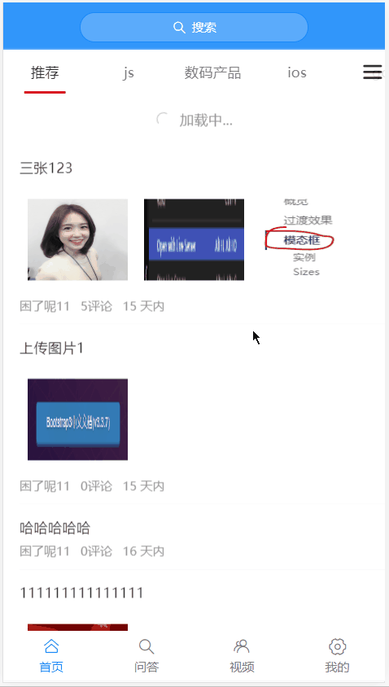

这里主要使用到 Vant 中的 [PullRefresh 下拉刷新](https://youzan.github.io/vant/#/zh-CN/pull-refresh) 组件。

思路：

- 注册下拉刷新事件（组件）的处理函数
- 发送请求获取文章列表数据
- 把获取到的数据添加到当前频道的文章列表的顶部
- 提示用户刷新成功！

下拉刷新时会触发组件的 `refresh` 事件，在事件的回调函数中可以进行同步或异步操作，操作完成后将 `v-model` 设置为 `false`，表示加载完成。

```js
// 当触发下拉刷新的时候调用该函数
async onRefresh () {
  try {
    // 1. 请求获取数据
    const { data } = await getArticles({
      channel_id: this.channel.id, // 频道 id
      timestamp: Date.now(), // 下拉刷新每次都应该获取最新数据
      with_top: 1 // 是否包含置顶，进入页面第一次请求时要包含置顶文章，1-包含置顶，0-不包含
    })

    // 2. 将数据追加到列表的顶部
    const { results } = data.data
    this.list.unshift(...results)

    // 3. 关闭下拉刷新的 loading 状态
    this.isRefreshLoading = false

    // 提示成功
    this.refreshSuccessText = `刷新成功，更新了${results.length}条数据`
  } catch (err) {
    console.log(err)
    this.isRefreshLoading = false // 关闭下拉刷新的 loading 状态
    this.$toast('刷新失败')
  }
}
```

## 文章列表项

### 准备组件

在我们项目中有好几个页面中都有这个文章列表项内容，如果我们在每个页面中都写一次的话不仅效率低而且维护起来也麻烦。所以最好的办法就是我们把它封装为一个组件，然后在需要使用的组件中加载使用即可。

1、创建 `src/components/article-item/index.vue` 组件

```html
<template>
  <div class="article-item">文章列表项</div>
</template>

<script>
  export default {
    name: "ArticleItem",
    components: {},
    props: {
      article: {
        type: Object,
        required: true,
      },
    },
    data() {
      return {};
    },
    computed: {},
    watch: {},
    created() {},
    mounted() {},
    methods: {},
  };
</script>

<style scoped lang="less"></style>
```

2、在文章列表组件中注册使用文章列表项组件

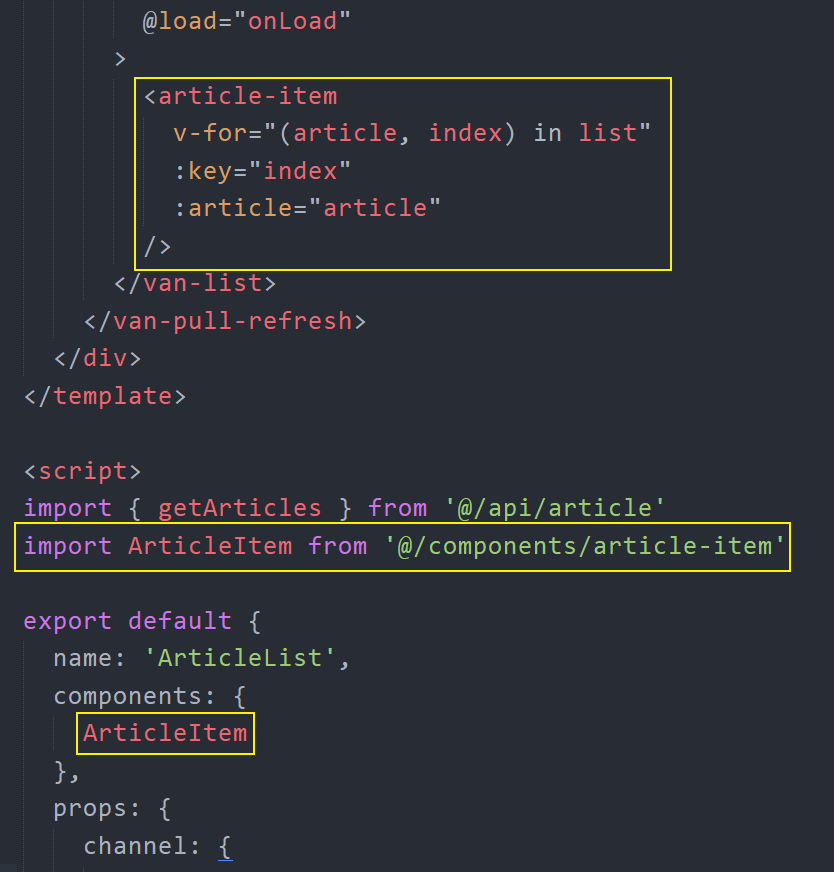

### 展示列表项内容

- 使用 Cell 单元格组件
- 展示标题
- 展示底部信息

```html
<template>
  <van-cell class="article-item">
    <div slot="title" class="title">{{ article.title }}</div>
    <div slot="label">
      <div v-if="article.cover.type === 3" class="cover-wrap">
        <div
          class="cover-item"
          v-for="(img, index) in article.cover.images"
          :key="index"
        >
          <van-image width="100" height="100" :src="img" />
        </div>
      </div>
      <div>
        <span>{{ article.aut_name }}</span>
        <span>{{ article.comm_count }}评论</span>
        <span>{{ article.pubdate }}</span>
      </div>
    </div>
    <van-image
      v-if="article.cover.type === 1"
      slot="default"
      width="100"
      height="100"
      :src="article.cover.images[0]"
    />
  </van-cell>
</template>

<script>
  export default {
    name: "ArticleItem",
    components: {},
    props: {
      article: {
        type: Object,
        required: true,
      },
    },
    data() {
      return {};
    },
    computed: {},
    watch: {},
    created() {},
    mounted() {},
    methods: {},
  };
</script>

<style scoped lang="less"></style>
```

### 样式调整

- 文章标题
  - 字号
  - 颜色
  - 多行文字省略
- 单图封面
  - 封面容器
    - 去除 flex: 1，固定宽高
    - 左内边距
  - 封面图
    - 宽高
    - 填充模式：cover
- 底部文本信息
  - 字号
  - 颜色
  - 间距
- 多图封面
  - 外层容器
    - flex 容器
    - 上下外边距
  - 图片容器
    - 平均分配容器空间：flex: 1;
    - 固定高度
    - 容器项间距
  - 图片
    - 宽高
    - 填充模式

以下代码仅供参考。

```html
<template>
  <van-cell class="article-item">
    <div slot="title" class="title van-multi-ellipsis--l2">
      {{ article.title }}
    </div>
    <div slot="label">
      <div v-if="article.cover.type === 3" class="cover-wrap">
        <div
          class="cover-item"
          v-for="(img, index) in article.cover.images"
          :key="index"
        >
          <van-image class="cover-item-img" fit="cover" :src="img" />
        </div>
      </div>
      <div class="label-info-wrap">
        <span>{{ article.aut_name }}</span>
        <span>{{ article.comm_count }}评论</span>
        <span>{{ article.pubdate }}</span>
      </div>
    </div>
    <van-image
      v-if="article.cover.type === 1"
      slot="default"
      class="right-cover"
      fit="cover"
      :src="article.cover.images[0]"
    />
  </van-cell>
</template>

<script>
  export default {
    name: "ArticleItem",
    components: {},
    props: {
      article: {
        type: Object,
        required: true,
      },
    },
    data() {
      return {};
    },
    computed: {},
    watch: {},
    created() {},
    mounted() {},
    methods: {},
  };
</script>

<style scoped lang="less">
  .article-item {
    .title {
      font-size: 32px;
      color: #3a3a3a;
    }

    .van-cell__value {
      flex: unset;
      width: 232px;
      height: 146px;
      padding-left: 25px;
    }

    .right-cover {
      width: 232px;
      height: 146px;
    }

    .label-info-wrap span {
      font-size: 22px;
      color: #b4b4b4;
      margin-right: 25px;
    }

    .cover-wrap {
      display: flex;
      padding: 30px 0;
      .cover-item {
        flex: 1;
        height: 146px;
        &:not(:last-child) {
          padding-right: 4px;
        }
        .cover-item-img {
          width: 100%;
          height: 146px;
        }
      }
    }
  }
</style>
```

### 关于第三方图片资源 403 问题

为什么文章列表数据中的好多图片资源请求失败返回 403？

```
这是因为我们项目的接口数据是后端通过爬虫抓取的第三方平台内容，而第三方平台对图片资源做了防盗链保护处理。
```

第三方平台怎么处理图片资源保护的？

```
服务端一般使用 Referer 请求头识别访问来源，然后处理资源访问。
```

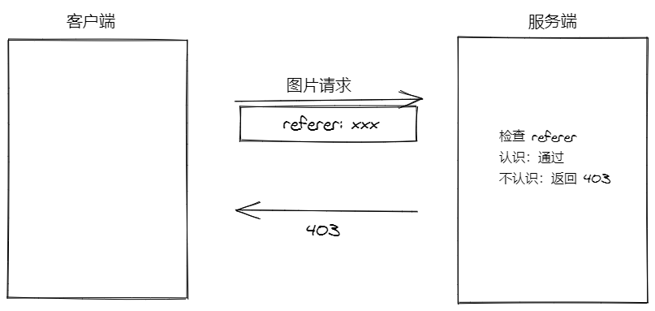

Referer 是什么东西？

> 扩展参考：http://www.ruanyifeng.com/blog/2019/06/http-referer.html

```
Referer 是 HTTP 请求头的一部分，当浏览器向 Web 服务器发送请求的时候，一般会带上 Referer，它包含了当前请求资源的来源页面的地址。服务端一般使用 Referer 请求头识别访问来源，可能会以此进行统计分析、日志记录以及缓存优化等。
```

> 需要注意的是 referer 实际上是 "referrer" 误拼写。参见 [HTTP referer on Wikipedia](https://zh.wikipedia.org/wiki/HTTP_referer) （HTTP referer 在维基百科上的条目）来获取更详细的信息。

怎么解决？

```
不要发送 referrer ，对方服务端就不知道你从哪来的了，姑且认为是你是自己人吧。
```

如何设置不发送 referrer？

用 `<a>`、`<area>`、``、`<iframe>`、`<script>` 或者 `<link>` 元素上的 `referrerpolicy` 属性为其设置独立的请求策略，例如：

```html

```

或者直接在 HTMl 页面头中通过 meta 属性全局配置：

```html
<meta name="referrer" content="no-referrer" />
```

### 处理相对时间

推荐两个第三方库：

- [Moment.js](https://momentjs.com/)
- [Day.js](https://day.js.org/)

两者都是专门用于处理时间的 JavaScript 库，功能差不多，因为 Day.js 的设计就是参考的 Moment.js。但是 Day.js 相比 Moment.js 的包体积要更小一些，因为它采用了插件化的处理方式。

[Day.js](https://day.js.org/zh-CN/) 是一个轻量的处理时间和日期的 JavaScript 库，和 [Moment.js](https://momentjs.com/) 的 API 设计保持完全一样，如果您曾经用过 Moment.js, 那么您已经知道如何使用 Day.js 。

- Day.js 可以运行在浏览器和 Node.js 中。

- 🕒 和 Moment.js 相同的 API 和用法
- 💪 不可变数据 (Immutable)
- 🔥 支持链式操作 (Chainable)
- 🌐 国际化 I18n
- 📦 仅 2kb 大小的微型库
- 👫 全浏览器兼容

1、安装

```sh
npm i dayjs
```

2、创建 `utils/dayjs.js`

```js
import Vue from "vue";
import dayjs from "dayjs";

// 加载中文语言包
import "dayjs/locale/zh-cn";

import relativeTime from "dayjs/plugin/relativeTime";

// 配置使用处理相对时间的插件
dayjs.extend(relativeTime);

// 配置使用中文语言包
dayjs.locale("zh-cn");

// 全局过滤器：处理相对时间
Vue.filter("relativeTime", (value) => {
  return dayjs().to(dayjs(value));
});
```

3、在 `main.js` 中加载初始化

```js
import "./utils/dayjs";
```

4、使用

使用过滤器：

```html
<p>{{ 日期数据 | relativeTime }}</p>
```

# 五、首页—频道编辑


## 处理页面弹出层

Vant 中内置了 [Popup 弹出层](https://youzan.github.io/vant/#/zh-CN/popup) 组件。

1、在 `data`中添加一个数据用来控制弹层的显示和隐藏

```js
data () {
  return {
    ...
    isChannelEditShow: true // 这里我们先设置为 true 就能看到弹窗的页面了
  }
}
```

2、然后在首页模板中的频道列表后面添加弹出层组件

```html
<!-- 频道编辑 -->
<van-popup
  class="edit-channel-popup"
  v-model="isEditChannelShow"
  position="bottom"
  :style="{ height: '100%' }"
  closeable
  close-icon-position="top-left"
  >内容</van-popup
>
<!-- /频道编辑 -->
```

```less
.edit-channel-popup {
  padding-top: 100px;
  box-sizing: border-box;
}
```

测试查看结果。

## 创建频道编辑组件

1、创建 `views/home/components/channel-edit.vue`

```html
<template>
  <div class="channel-edit">频道编辑</div>
</template>

<script>
  export default {
    name: "ChannelEdit",
    components: {},
    props: {},
    data() {
      return {};
    },
    computed: {},
    watch: {},
    created() {},
    mounted() {},
    methods: {},
  };
</script>

<style scoped lang="less"></style>
```

2、在首页中加载注册

```js
import ChannelEdit from "./components/channel-edit";
```

```js
export default {
  ...
  components: {
    ...
    ChannelEdit
  }
}
```

3、在弹出层中使用频道编辑组件

```html
<!-- 频道编辑 -->
<van-popup
  v-model="isChannelEditShow"
  position="bottom"
  closeable
  close-icon-position="top-left"
  :style="{ height: '100%' }"
>
  + <channel-edit />
</van-popup>
<!-- /频道编辑 -->
```

## 页面布局

```html
<template>
  <div class="channel-edit">
    <van-cell title="我的频道" :border="false">
      <van-button size="mini" round type="danger" plain>编辑</van-button>
    </van-cell>
    <van-grid :gutter="10">
      <van-grid-item
        class="channel-item"
        v-for="value in 8"
        :key="value"
        text="文字"
      />
    </van-grid>
    <van-cell title="频道推荐" :border="false"></van-cell>
    <van-grid :gutter="10">
      <van-grid-item
        class="channel-item"
        v-for="value in 8"
        :key="value"
        text="文字"
      />
    </van-grid>
  </div>
</template>

<script>
  export default {
    name: "ChannelEdit",
    components: {},
    props: {},
    data() {
      return {};
    },
    computed: {},
    watch: {},
    created() {},
    mounted() {},
    methods: {},
  };
</script>

<style scoped lang="less">
  .channel-edit {
    .channel-item {
      height: 86px;
      /deep/ .van-grid-item__content {
        background-color: #f5f5f6;
        .van-grid-item__text {
          color: #222;
          font-size: 28px;
        }
      }
    }
  }
</style>
```

## 展示我的频道

1、在父组件中把 `channels` 传递给频道编辑组件


2、在频道编辑组件中声明接收父组件的 `userChannels` 频道列表数据并遍历展示

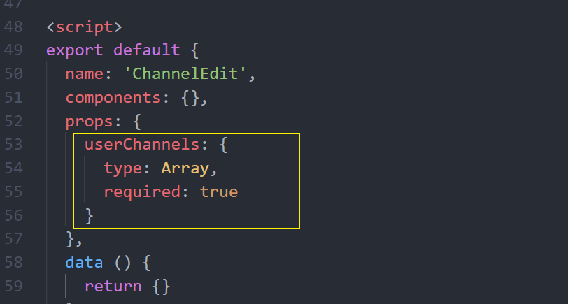

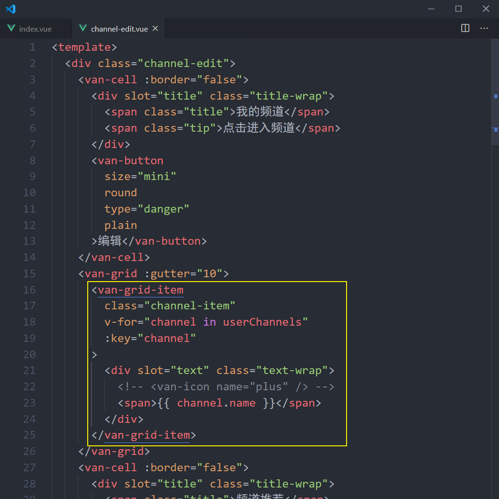

## 展示推荐频道列表


没有用来获取推荐频道的数据接口，但是我们有获取所有频道列表的数据接口。

所以：`所有频道列表 - 我的频道 = 剩余推荐的频道`。

实现过程所以一共分为两大步：

- 获取所有频道
- 基于所有频道和我的频道计算获取剩余的推荐频道

### 获取所有频道

1、封装数据接口

```js
/**
 * 获取所有频道
 */
export const getAllChannels = () => {
  return request({
    method: "GET",
    url: "/app/v1_0/channels",
  });
};
```

2、在编辑频道组件中请求获取所有频道数据

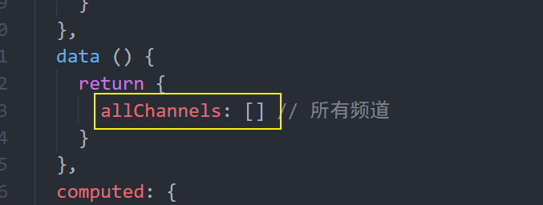


3、在调试工具中测试是否有拿到数据

### 处理展示推荐频道

思路：`所有频道 - 用户频道 = 推荐频道`

1、封装计算属性筛选数据


- 遍历所有频道
- 对每一个频道都判断：该频道是否属于我的频道
- 如果不属于我的频道，则收集起来
- 直到遍历结束，剩下来就是那些剩余的推荐频道

2、模板绑定

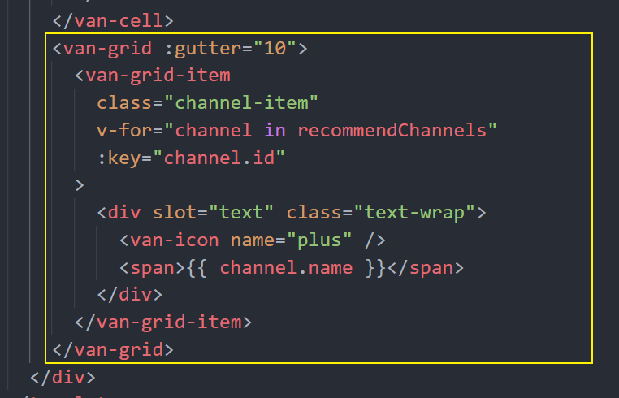

## 添加频道


思路：

- 给推荐频道列表中每一项注册点击事件
- 获取点击的频道项
- 将频道项添加到我的频道中
- ~~将当前点击的频道项从推荐频道中移除~~
  - 不需要删除，因为我们获取数据使用的是计算属性，当我频道发生改变，计算属性重新求值了

1、给推荐频道中的频道注册点击事件

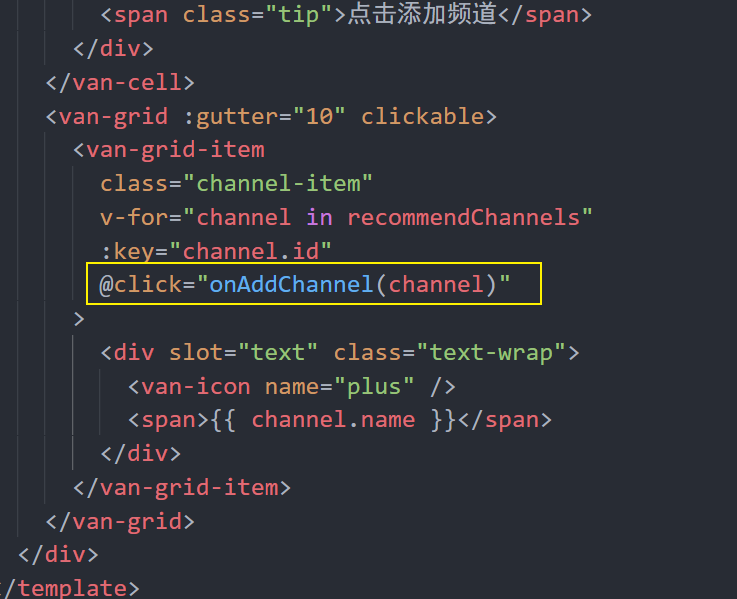

2、在添加频道事件处理函数中

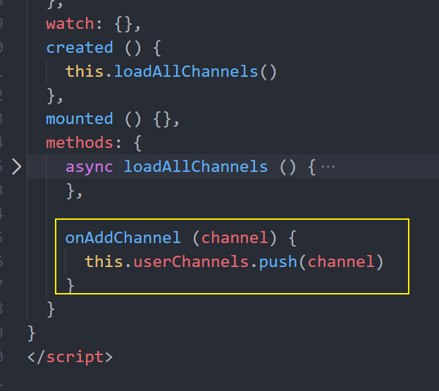

然后你会神奇的发现点击的那个推荐频道跑到我的频道中了，我们并没有去手动的删除点击的这个推荐频道，但是它没了！主要是因为推荐频道是通过一个计算属性获取的，计算属性中使用了 channels（我的频道）数据，所以只要我的频道中的数据发生变化，那么计算属性就会重新运算获取最新的数据。

## 编辑频道

思路：

- 给我的频道中的频道项注册点击事件
- 在事件处理函数中
  - 如果是编辑状态，则执行删除频道操作
  - 如果是非编辑状态，则执行切换频道操作

### 处理编辑状态

1、在 data 中添加数据用来控制编辑状态的显示

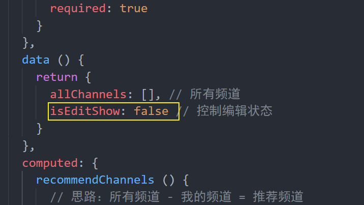

2、在我的频道项中添加删除图标

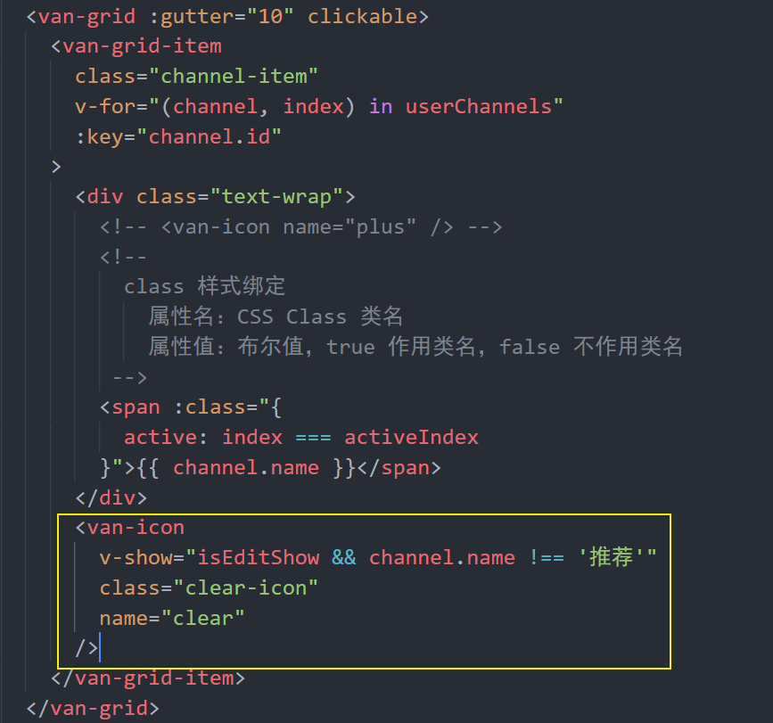

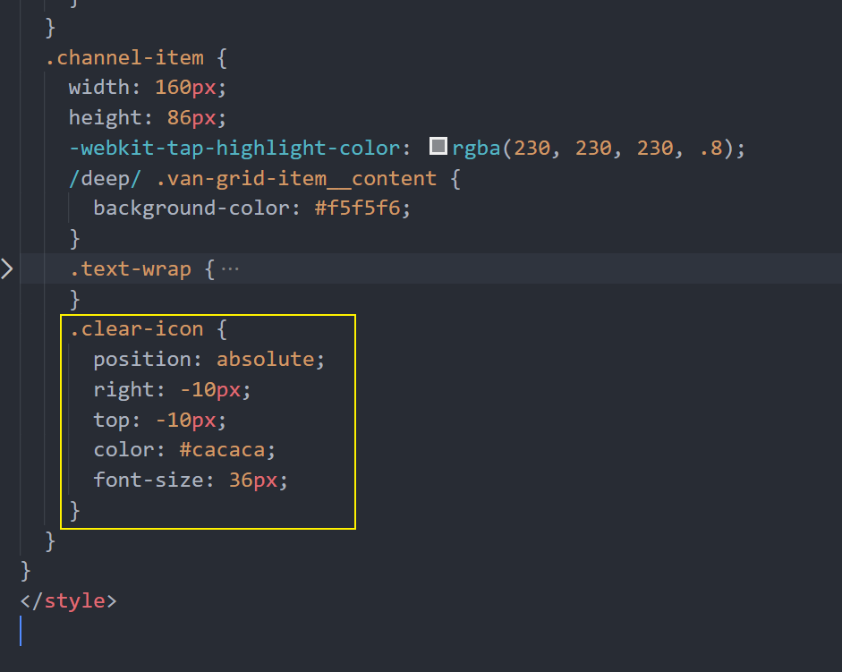

3、处理点击编辑按钮


### 切换频道

功能需求：在非编辑器状态下切换频道。

1、给我的频道项注册点击事件


2、处理函数

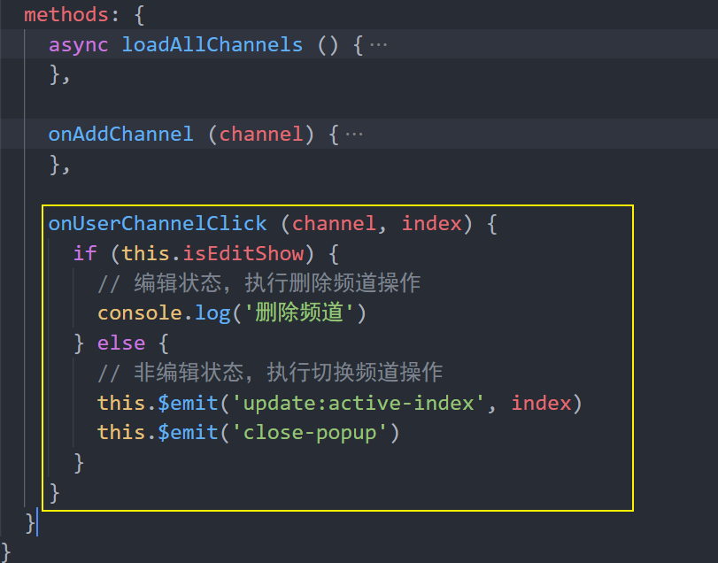

3、在父组件中监听处理自定义事件


### 让激活频道高亮

思路：

- 将首页中的激活的标签索引传递给频道编辑组件
- 在频道编辑组件中遍历我的频道列表的时候判断遍历项的索引是否等于激活的频道标签索引，如果一样则作用一个高亮的 CSS 类名

1、将首页组件中的 `active` 传递到频道编辑组件中


2、在频道编辑组件中声明 props 接收


3、判断遍历项，如果 `遍历项索引 === active`，则给这个频道项设置高亮样式

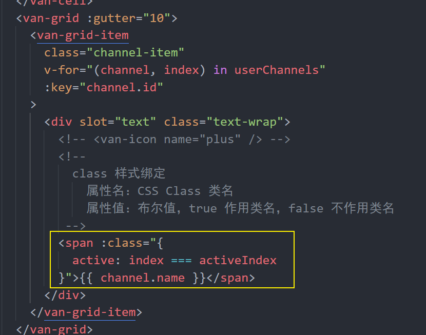


### 删除频道

功能需求：在编辑状态下删除频道。


## 频道数据持久化

### 业务分析

频道编辑这个功能，无论用户是否登录用户都可以使用。

不登录也能使用

- 数据存储在本地
- 不支持同步功能

登录也能使用

- 数据存储在线上后台服务器
- 更换不同的设备可以同步数据

### 添加频道

思路：

- 如果未登录，则存储到本地
- 如果已登录，则存储到线上
  - 找到数据接口
  - 封装请求方法
  - 请求调用

1、封装添加频道的请求方法

```js
/**
 * 添加用户频道
 */
export const addUserChannel = (channels) => {
  return request({
    method: "PATCH",
    url: "/app/v1_0/user/channels",
    data: {
      channels,
    },
  });
};
```

2、修改添加频道的处理逻辑

```js
async onAddChannel (channel) {
  try {
    this.userChannels.push(channel)
    if (this.user) {
      // 已登录，数据存储到线上
      await addUserChannel([{
        id: channel.id, // 频道 id
        seq: this.userChannels.length // 频道的 序号
      }])
    } else {
      // 未登录，数据存储到本地
      setItem('channels', this.userChannels)
    }
  } catch (err) {
    console.log(err)
    this.$toast('添加频道失败')
  }
},
```

### 删除频道

思路：

- 如果未登录，则存储到本地
- 如果已登录，则存储到线上
  - 找到数据接口
  - 封装请求方法
  - 请求调用

1、封装删除用户频道请求方法

```js
/**
 * 删除用户频道
 */
export const deleteUserChannel = (channelId) => {
  return request({
    method: "DELETE",
    url: `/app/v1_0/user/channels/${channelId}`,
  });
};
```

2、修改删除频道的处理逻辑


```js
async deleteChannel (channel) {
  try {
    if (this.user) {
      // 已登录，将数据存储到线上
      await deleteUserChannel(channel.id)
    } else {
      // 未登录，将数据存储到本地
      setItem('channles', this.userChannels)
    }
  } catch (err) {
    console.log(err)
    this.$toast('删除频道失败，请稍后重试')
  }
}
```

## 正确的获取首页频道列表数据


> 提示：获取登录用户的频道列表和获取默认推荐的频道列表是同一个数据接口。后端会根据接口中的 token 来判定返回数据。

```js
async loadChannels () {
  try {
    let channels = []
    if (this.user) {
      // 已登录，请求获取线上的频道数据
      const { data } = await getChannels()
      channels = data.data.channels
    } else {
      // 未登录
      const localChannels = getItem('channels')
      if (localChannels) {
        // 有本地频道数据，则使用
        channels = localChannels
      } else {
        // 没有本地频道数据，则请求获取默认推荐的频道列表
        const { data } = await getChannels()
        channels = data.data.channels
      }
    }

    // 将数据更新到组件中
    this.channels = channels
  } catch (err) {
    console.log(err)
    this.$toast('数据获取失败')
  }
},
```

# 六、文章搜索


## 创建组件并配置路由

1、创建 `src/views/search/index.vue`

```html
<template>
  <div class="search-container">搜索页面</div>
</template>

<script>
  export default {
    name: "SearchPage",
    components: {},
    props: {},
    data() {
      return {};
    },
    computed: {},
    watch: {},
    created() {},
    methods: {},
  };
</script>

<style scoped></style>
```

2、然后把搜索页面的路由配置到根组件路由（一级路由）

```js
{
  path: '/search',
  omponent: Search
}
```

最后访问 `/search` 测试。

## 页面布局

1、创建 `src/views/search/components/search-history.vue`

```html
<template>
  <div class="search-history">
    <van-cell title="搜索历史">
      <span>全部删除</span>
      <span>完成</span>
      <van-icon name="delete" />
    </van-cell>
    <van-cell title="hello">
      <van-icon name="close" />
    </van-cell>
    <van-cell title="hello">
      <van-icon name="close" />
    </van-cell>
    <van-cell title="hello">
      <van-icon name="close" />
    </van-cell>
    <van-cell title="hello">
      <van-icon name="close" />
    </van-cell>
  </div>
</template>

<script>
  export default {
    name: "SearchHistory",
    components: {},
    props: {},
    data() {
      return {};
    },
    computed: {},
    watch: {},
    created() {},
    mounted() {},
    methods: {},
  };
</script>

<style scoped lang="less"></style>
```

2、创建 `src/views/search/components/search-suggestion.vue`

```html
<template>
  <div class="search-suggestion">
    <van-cell title="黑马程序员..." icon="search"></van-cell>
    <van-cell title="黑马程序员..." icon="search"></van-cell>
    <van-cell title="黑马程序员..." icon="search"></van-cell>
    <van-cell title="黑马程序员..." icon="search"></van-cell>
    <van-cell title="黑马程序员..." icon="search"></van-cell>
  </div>
</template>

<script>
  export default {
    name: "SearchSuggestion",
    components: {},
    props: {},
    data() {
      return {};
    },
    computed: {},
    watch: {},
    created() {},
    mounted() {},
    methods: {},
  };
</script>

<style scoped lang="less"></style>
```

3、创建 `src/views/search/components/search-result.vue`

```html
<template>
  <div class="search-result">
    <van-list
      v-model="loading"
      :finished="finished"
      finished-text="没有更多了"
      @load="onLoad"
    >
      <van-cell v-for="item in list" :key="item" :title="item" />
    </van-list>
  </div>
</template>

<script>
  export default {
    name: "SearchResult",
    components: {},
    props: {},
    data() {
      return {
        list: [],
        loading: false,
        finished: false,
      };
    },
    computed: {},
    watch: {},
    created() {},
    mounted() {},
    methods: {
      onLoad() {
        // 异步更新数据
        // setTimeout 仅做示例，真实场景中一般为 ajax 请求
        setTimeout(() => {
          for (let i = 0; i < 10; i++) {
            this.list.push(this.list.length + 1);
          }

          // 加载状态结束
          this.loading = false;

          // 数据全部加载完成
          if (this.list.length >= 40) {
            this.finished = true;
          }
        }, 1000);
      },
    },
  };
</script>

<style scoped lang="less"></style>
```

4、搜索组件内容如下：

```html
<template>
  <div class="search-container">
    <!-- 搜索栏 -->
    <!--
      Tips: 在 van-search 外层增加 form 标签，且 action 不为空，即可在 iOS 输入法中显示搜索按钮
     -->
    <form action="/">
      <van-search
        v-model="searchText"
        show-action
        placeholder="请输入搜索关键词"
        background="#3296fa"
        @search="onSearch"
        @cancel="onCancel"
      />
    </form>
    <!-- /搜索栏 -->

    <!-- 搜索历史记录 -->
    <search-history />
    <!-- /搜索历史记录 -->

    <!-- 联想建议 -->
    <search-suggestion />
    <!-- /联想建议 -->

    <!-- 历史记录 -->
    <search-result />
    <!-- /历史记录 -->
  </div>
</template>

<script>
  import SearchHistory from "./components/search-history";
  import SearchSuggestion from "./components/search-suggestion";
  import SearchResult from "./components/search-result";

  export default {
    name: "SearchIndex",
    components: {
      SearchHistory,
      SearchSuggestion,
      SearchResult,
    },
    props: {},
    data() {
      return {
        searchText: "",
      };
    },
    computed: {},
    watch: {},
    created() {},
    mounted() {},
    methods: {
      onSearch(val) {
        console.log(val);
      },
      onCancel() {
        this.$router.back();
      },
    },
  };
</script>

<style scoped lang="less">
  .search-container {
    .van-search__action {
      color: #fff;
    }
  }
</style>
```

## 处理页面显示状态

1、在 `data` 中添加数据用来控制搜索结果的显示状态

```js
data () {
  ...
  isResultShow: false
}
```

2、在模板中绑定条件渲染

```html
<!-- 搜索结果 -->
<search-result v-if="isResultShow" />
<!-- /搜索结果 -->

<!-- 联想建议 -->
<search-suggestion v-else-if="searchText" />
<!-- /联想建议 -->

<!-- 搜索历史记录 -->
<search-history v-else />
<!-- /搜索历史记录 -->
```

## 搜索联想建议

基本思路：

- 当搜索框输入内容的时候，请求加载联想建议的数据
- 将请求得到的结果绑定到模板中

### 基本功能

一、将父组件中搜索框输入的内容传给联想建议子组件

二、在子组件中监视搜索框输入内容的变化，如果变化则请求获取联想建议数据

三、将获取到的联想建议数据展示到列表中

### 防抖优化

1、安装 lodash

```sh
# yarn add lodash
npm i lodash
```

2、防抖处理

```js
// lodash 支持按需加载，有利于打包结果优化
import { debounce } from "lodash";
```

> 不建议下面这样使用，因为这样会加载整个模块。
>
> ```js
> import _ from "lodash";
> _.debounce();
> ```

```js
// debounce 函数
// 参数1：函数
// 参数2：防抖时间
// 返回值：防抖之后的函数，和参数1功能是一样的
onSearchInput: debounce(async function () {
  const searchContent = this.searchContent
  if (!searchContent) {
    return
  }

  // 1. 请求获取数据
  const { data } = await getSuggestions(searchContent)

  // 2. 将数据添加到组件实例中
  this.suggestions = data.data.options

  // 3. 模板绑定
}, 200),
```

### 搜索关键字高亮

如何将字符串中的指定字符在**网页**中高亮展示？

```js
"Hello World";
```

将需要高亮的字符包裹 HTML 标签，为其单独设置颜色。

```js
"Hello <span style="color: red">World</span>"
```

在 Vue 中如何渲染带有 HTML 标签的字符串？

```js
data () {
  return {
    htmlStr: 'Hello <span style="color: red">World</span>'
  }
}
```

```html
<div>{{ htmlStr }}</div>
<div v-html="htmlStr"></div>
```

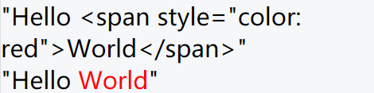

如何把字符串中指定字符统一替换为高亮（包裹了 HTML）的字符？

```js
const str = "Hello World";

// 结果：<span style="color: red">Hello</span> World
"Hello World".replace("Hello", '<span style="color: red">Hello</span>');

// 需要注意的是，replace 方法的字符串匹配只能替换第1个满足的字符
// <span style="color: red">Hello</span> World Hello abc
"Hello World Hello abc".replace(
  "Hello",
  '<span style="color: red">Hello</span>'
);

// 如果想要全文替换，使用正则表达式
// g 全局
// i 忽略大小写
// <span style="color: red">Hello</span> World <span style="color: red">Hello</span> abc
"Hello World Hello abc".replace(
  /Hello/gi,
  '<span style="color: red">Hello</span>'
);
```

> 一个小扩展：使用字符串的 split 结合数组的 join 方法实现高亮
>
> ```js
> var str = "hello world 你好 hello";
>
> // ["", " world 你好 ", ""]
> const arr = str.split("hello");
>
> // "<span>hello</span> world 你好 <span>hello</span>"
> arr.join("<span>hello</span>");
> ```

下面是具体的处理。

1、在 methods 中添加一个方法处理高亮

```js
// 参数 source: 原始字符串
// 参数 keyword: 需要高亮的关键词
// 返回值：替换之后的高亮字符串
highlight (source, keyword) {
  // /searchContent/ 正则表达式中的一切内容都会当做字符串使用
  // 这里可以 new RegExp 方式根据字符串创建一个正则表达式
  // RegExp 是原生 JavaScript 的内置构造函数
  // 参数1：字符串，注意，这里不要加 //
  // 参数2：匹配模式，g 全局，i 忽略大小写
  const reg = new RegExp(keyword, 'gi')
  return source.replace(reg, `<span style="color: #3296fa">${keyword}</span>`)
},
```

2、然后在联想建议列表项中绑定调用

```html
<!-- 联想建议 -->
<van-cell-group v-else-if="searchContent">
  <van-cell
    icon="search"
    v-for="(item, index) in suggestions"
    :key="index"
    @click="onSearch(item)"
  >
    <div slot="title" v-html="highlight(item, searchContent)"></div>
  </van-cell>
</van-cell-group>
<!-- /联想建议 -->
```

## 搜索结果

思路：

- 找到数据接口
- 请求获取数据
- 将数据展示到模板中

一、获取搜索关键字

1、声明接收父组件中的搜索框输入的内容

```js
props: {
  q: {
    type: String,
    require: true
  }
},
```

2、在父组件给子组件传递数据

```html
<!-- 搜索结果 -->
<search-result v-if="isResultShow" :q="searchText" />
<!-- /搜索结果 -->
```

最后在调试工具中查看确认是否接收到 props 数据。


二、请求获取数据

1、在 `api/serach.js` 添加封装获取搜索结果的请求方法

```js
/**
 * 获取搜索结果
 */
export function getSearch(params) {
  return request({
    method: "GET",
    url: "/app/v1_0/search",
    params,
  });
}
```

2、请求获取

```js
+ import { getSearch } from '@/api/search'

export default {
  name: 'SearchResult',
  components: {},
  props: {
    q: {
      type: String,
      require: true
    }
  },
  data () {
    return {
      list: [],
      loading: false,
      finished: false,
+      page: 1,
+      perPage: 20
    }
  },
  computed: {},
  watch: {},
  created () {},
  mounted () {},
  methods: {
+++    async onLoad () {
      // 1. 请求获取数据
      const { data } = await getSearch({
        page: this.page, // 页码
        per_page: this.perPage, // 每页大小
        q: this.q // 搜索关键字
      })

      // 2. 将数据添加到列表中
      const { results } = data.data
      this.list.push(...results)

      // 3. 设置加载状态结束
      this.loading = false

      // 4. 判断数据是否加载完毕
      if (results.length) {
        this.page++ // 更新获取下一页数据的页码
      } else {
        this.finished = true // 没有数据了，将加载状态设置结束，不再 onLoad
      }
    }
  }
}
```

三、最后，模板绑定

```html
<van-list
  v-model="loading"
  :finished="finished"
  finished-text="没有更多了"
  @load="onLoad"
>
  <van-cell
    +
    v-for="(article, index) in list"
    +
    :key="index"
    +
    :title="article.title"
  />
</van-list>
```

## 搜索历史记录

### 添加历史记录

当发生搜索的时候我们才需要记录历史记录。

1、在 data 中添加一个数据用来存储历史记录

```js
data () {
  return {
    ...
    searchHistories: []
  }
}
```

2、在触发搜索的时候，记录历史记录

```js
onSearch (val) {
  // 更新文本框内容
  this.searchText = val

  // 存储搜索历史记录
  // 要求：不要有重复历史记录、最新的排在最前面
  const index = this.searchHistories.indexOf(val)
  if (index !== -1) {
    this.searchHistories.splice(index, 1)
  }
  this.searchHistories.unshift(val)

  // 渲染搜索结果
  this.isResultShow = true
},
```

### 展示历史记录

```html
<!-- 历史记录 -->
<van-cell-group v-else>
  <van-cell title="历史记录">
    <van-icon name="delete" />
    <span>全部删除</span>
    &nbsp;&nbsp;
    <span>完成</span>
  </van-cell>
  <van-cell :title="item" v-for="(item, index) in searchHistories" :key="index">
    <van-icon name="close"></van-icon>
  </van-cell>
</van-cell-group>
<!-- /历史记录 -->
```

### 删除历史记录

基本思路：

- 给历史记录中的每一项注册点击事件
- 在处理函数中判断
  - 如果是删除状态，则执行删除操作
  - 如果是非删除状态，则执行搜索操作

一、处理删除相关元素的展示状态

1、在 data 中添加一个数据用来控制删除相关元素的显示状态

```js
data () {
  return {
    ...
    isDeleteShow: false
  }
}
```

2、绑定使用

```html
<!-- 历史记录 -->
<van-cell-group v-else>
  <van-cell title="历史记录">
    <template v-if="isDeleteShow">
      <span @click="searchHistories = []">全部删除</span>
      &nbsp;&nbsp;
      <span @click="isDeleteShow = false">完成</span>
    </template>
    <van-icon v-else name="delete" @click="isDeleteShow = true"></van-icon>
  </van-cell>
  <van-cell
    :title="item"
    v-for="(item, index) in searchHistories"
    :key="index"
    @click="onSearch(item)"
  >
    <van-icon
      v-show="isDeleteShow"
      name="close"
      @click="searchHistories.splice(index, 1)"
    ></van-icon>
  </van-cell>
</van-cell-group>
<!-- /历史记录 -->
```

二、处理删除操作

```html
<!-- 历史记录 -->
<van-cell-group v-else>
  <van-cell title="历史记录">
    <template v-if="isDeleteShow">
      + <span @click="searchHistories = []">全部删除</span>
      &nbsp;&nbsp;
      <span @click="isDeleteShow = false">完成</span>
    </template>
    <van-icon v-else name="delete" @click="isDeleteShow = true" />
  </van-cell>
  <van-cell
    :title="item"
    v-for="(item, index) in searchHistories"
    :key="index"
    +
    @click="onHistoryClick(item, index)"
  >
    <van-icon v-show="isDeleteShow" name="close"></van-icon>
  </van-cell>
</van-cell-group>
<!-- /历史记录 -->
```

```js
onHistoryClick (item, index) {
  // 如果是删除状态，则执行删除操作
  if (this.isDeleteShow) {
    this.searchHistories.splice(index, 1)
  } else {
    // 否则执行搜索操作
    this.onSearch(item)
  }
}
```

### 数据持久化

1、利用 watch 监视统一存储数据

```js
watch: {
  searchHistories (val) {
    // 同步到本地存储
    setItem('serach-histories', val)
  }
},
```

2、初始化的时候从本地存储获取数据

```js
data () {
  return {
    ...
    searchHistories: getItem('serach-histories') || [],
  }
}
```

# 七、文章详情

## 创建组件并配置路由

1、创建 `views/article/index.vue` 组件

```html
<template>
  <div class="article-container">文章详情</div>
</template>

<script>
  export default {
    name: "ArticleIndex",
    components: {},
    props: {
      articleId: {
        type: [Number, String],
        required: true,
      },
    },
    data() {
      return {};
    },
    computed: {},
    watch: {},
    created() {},
    mounted() {},
    methods: {},
  };
</script>

<style scoped lang="less"></style>
```

2、然后将该页面配置到根级路由

```js
{
  path: '/article/:articleId',
  name: 'article',
  component: () => import('@/views/article'),
  // 将路由动态参数映射到组件的 props 中，更推荐这种做法
  props: true
}
```

> [官方文档：路由 props 传参](https://router.vuejs.org/zh/guide/essentials/passing-props.html)

## 页面布局

使用到的 Vant 中的组件：

- [NavBar 导航栏](https://youzan.github.io/vant/#/zh-CN/nav-bar)

- [Loading 加载](https://youzan.github.io/vant/#/zh-CN/loading)
- [Cell 单元格](https://youzan.github.io/vant/#/zh-CN/cell)
- [Button 按钮](https://youzan.github.io/vant/#/zh-CN/button)
- [Image 图片](https://youzan.github.io/vant/#/zh-CN/image)
- [Divider 分割线](https://youzan.github.io/vant/#/zh-CN/divider)
- [Icon 图标](https://youzan.github.io/vant/#/zh-CN/icon)

```html
<template>
  <div class="article-container">
    <!-- 导航栏 -->
    <van-nav-bar class="page-nav-bar" left-arrow title="黑马头条"></van-nav-bar>
    <!-- /导航栏 -->

    <div class="main-wrap">
      <!-- 加载中 -->
      <div class="loading-wrap">
        <van-loading color="#3296fa" vertical>加载中</van-loading>
      </div>
      <!-- /加载中 -->

      <!-- 加载完成-文章详情 -->
      <div class="article-detail">
        <!-- 文章标题 -->
        <h1 class="article-title">这是文章标题</h1>
        <!-- /文章标题 -->

        <!-- 用户信息 -->
        <van-cell class="user-info" center :border="false">
          <van-image
            class="avatar"
            slot="icon"
            round
            fit="cover"
            src="https://img.yzcdn.cn/vant/cat.jpeg"
          />
          <div slot="title" class="user-name">黑马头条号</div>
          <div slot="label" class="publish-date">14小时前</div>
          <van-button
            class="follow-btn"
            type="info"
            color="#3296fa"
            round
            size="small"
            icon="plus"
            >关注</van-button
          >
          <!-- <van-button
            class="follow-btn"
            round
            size="small"
          >已关注</van-button> -->
        </van-cell>
        <!-- /用户信息 -->

        <!-- 文章内容 -->
        <div class="article-content">这是文章内容</div>
        <van-divider>正文结束</van-divider>
      </div>
      <!-- /加载完成-文章详情 -->

      <!-- 加载失败：404 -->
      <div class="error-wrap">
        <van-icon name="failure" />
        <p class="text">该资源不存在或已删除！</p>
      </div>
      <!-- /加载失败：404 -->

      <!-- 加载失败：其它未知错误（例如网络原因或服务端异常） -->
      <div class="error-wrap">
        <van-icon name="failure" />
        <p class="text">内容加载失败！</p>
        <van-button class="retry-btn">点击重试</van-button>
      </div>
      <!-- /加载失败：其它未知错误（例如网络原因或服务端异常） -->
    </div>

    <!-- 底部区域 -->
    <div class="article-bottom">
      <van-button class="comment-btn" type="default" round size="small"
        >写评论</van-button
      >
      <van-icon name="comment-o" info="123" color="#777" />
      <van-icon color="#777" name="star-o" />
      <van-icon color="#777" name="good-job-o" />
      <van-icon name="share" color="#777777"></van-icon>
    </div>
    <!-- /底部区域 -->
  </div>
</template>

<script>
  export default {
    name: "ArticleIndex",
    components: {},
    props: {
      articleId: {
        type: [Number, String],
        required: true,
      },
    },
    data() {
      return {};
    },
    computed: {},
    watch: {},
    created() {},
    mounted() {},
    methods: {},
  };
</script>

<style scoped lang="less">
  .article-container {
    .main-wrap {
      position: fixed;
      left: 0;
      right: 0;
      top: 92px;
      bottom: 88px;
      overflow-y: scroll;
      background-color: #fff;
    }
    .article-detail {
      .article-title {
        font-size: 40px;
        padding: 50px 32px;
        margin: 0;
        color: #3a3a3a;
      }

      .user-info {
        padding: 0 32px;
        .avatar {
          width: 70px;
          height: 70px;
          margin-right: 17px;
        }
        .van-cell__label {
          margin-top: 0;
        }
        .user-name {
          font-size: 24px;
          color: #3a3a3a;
        }
        .publish-date {
          font-size: 23px;
          color: #b7b7b7;
        }
        .follow-btn {
          width: 170px;
          height: 58px;
        }
      }

      .article-content {
        padding: 55px 32px;
        /deep/ p {
          text-align: justify;
        }
      }
    }

    .loading-wrap {
      padding: 200px 32px;
      display: flex;
      align-items: center;
      justify-content: center;
      background-color: #fff;
    }

    .error-wrap {
      padding: 200px 32px;
      display: flex;
      flex-direction: column;
      align-items: center;
      justify-content: center;
      background-color: #fff;
      .van-icon {
        font-size: 122px;
        color: #b4b4b4;
      }
      .text {
        font-size: 30px;
        color: #666666;
        margin: 33px 0 46px;
      }
      .retry-btn {
        width: 280px;
        height: 70px;
        line-height: 70px;
        border: 1px solid #c3c3c3;
        font-size: 30px;
        color: #666666;
      }
    }

    .article-bottom {
      position: fixed;
      left: 0;
      right: 0;
      bottom: 0;
      display: flex;
      justify-content: space-around;
      align-items: center;
      box-sizing: border-box;
      height: 88px;
      border-top: 1px solid #d8d8d8;
      background-color: #fff;
      .comment-btn {
        width: 282px;
        height: 46px;
        border: 2px solid #eeeeee;
        font-size: 30px;
        line-height: 46px;
        color: #a7a7a7;
      }
      .van-icon {
        font-size: 40px;
        .van-info {
          font-size: 16px;
          background-color: #e22829;
        }
      }
    }
  }
</style>
```

## 关于后端返回数据中的大数字问题

之所以请求文章详情返回 404 是因为我们请求发送的文章 ID （article.art_id）不正确。

JavaScript 能够准确表示的整数范围在`-2^53`到`2^53`之间（不含两个端点），超过这个范围，无法精确表示这个值，这使得 JavaScript 不适合进行科学和金融方面的精确计算。

```javascript
Math.pow(2, 53); // 9007199254740992

9007199254740992; // 9007199254740992
9007199254740993; // 9007199254740992

Math.pow(2, 53) === Math.pow(2, 53) + 1;
// true
```

上面代码中，超出 2 的 53 次方之后，一个数就不精确了。
ES6 引入了`Number.MAX_SAFE_INTEGER`和`Number.MIN_SAFE_INTEGER`这两个常量，用来表示这个范围的上下限。

```javascript
Number.MAX_SAFE_INTEGER === Math.pow(2, 53) - 1;
// true
Number.MAX_SAFE_INTEGER === 9007199254740991;
// true

Number.MIN_SAFE_INTEGER === -Number.MAX_SAFE_INTEGER;
// true
Number.MIN_SAFE_INTEGER === -9007199254740991;
// true
```

上面代码中，可以看到 JavaScript 能够精确表示的极限。

后端返回的数据一般都是 **JSON 格式的字符串**。

```json
"{ \"id\": 9007199254740995, \"name\": \"Jack\", \"age\": 18 }"
```

如果这个字符不做任何处理，你能方便的获取到字符串中的指定数据吗？非常麻烦。所以我们要把它转换为 JavaScript 对象来使用就很方便了。

幸运的是 axios 为了方便我们使用数据，它会在内部使用 `JSON.parse()` 把后端返回的数据转为 JavaScript 对象。

```javascript
// { id: 9007199254740996, name: 'Jack', age: 18 }
JSON.parse('{ "id": 9007199254740995, "name": "Jack", "age": 18 }');
```

可以看到，超出安全整数范围的 id 无法精确表示，这个问题并不是 axios 的错。

了解了什么是大整数的概念，接下来的问题是如何解决？

[json-bigint](https://github.com/sidorares/json-bigint) 是一个第三方包，它可以帮我们很好的处理这个问题。

使用它的第一步就是把它安装到你的项目中。

```shell
npm i json-bigint
```

下面是使用它的一个简单示例。

```javascript
const jsonStr = '{ "art_id": 1245953273786007552 }';

console.log(JSON.parse(jsonStr)); // 1245953273786007600
// JSON.stringify()

// JSONBig 可以处理数据中超出 JavaScript 安全整数范围的问题
console.log(JSONBig.parse(jsonStr)); // 把 JSON 格式的字符串转为 JavaScript 对象

// 使用的时候需要把 BigNumber 类型的数据转为字符串来使用
console.log(JSONBig.parse(jsonStr).art_id.toString()); // 1245953273786007552

console.log(JSON.stringify(JSONBig.parse(jsonStr)));

console.log(JSONBig.stringify(JSONBig.parse(jsonStr))); // 把 JavaScript 对象 转为 JSON 格式的字符串转
```

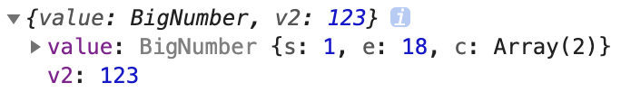

> json-bigint 会把超出 JS 安全整数范围的数字转为一个 BigNumber 类型的对象，对象数据是它内部的一个算法处理之后的，我们要做的就是在使用的时候转为字符串来使用。

通过 Axios 请求得到的数据都是 Axios 处理（JSON.parse）之后的，我们应该在 Axios 执行处理之前手动使用 json-bigint 来解析处理。Axios 提供了自定义处理原始后端返回数据的 API：`transformResponse` 。

```javascript
import axios from "axios";

import jsonBig from "json-bigint";

var json = '{ "value" : 9223372036854775807, "v2": 123 }';

console.log(jsonBig.parse(json));

const request = axios.create({
  baseURL: "http://ttapi.research.itcast.cn/", // 接口基础路径

  // transformResponse 允许自定义原始的响应数据（字符串）
  transformResponse: [
    function (data) {
      try {
        // 如果转换成功则返回转换的数据结果
        return jsonBig.parse(data);
      } catch (err) {
        // 如果转换失败，则包装为统一数据格式并返回
        return {
          data,
        };
      }
    },
  ],
});

export default request;
```

> 扩展：ES2020 BigInt
>
> ES2020 引入了一种新的数据类型 BigInt（大整数），来解决这个问题。BigInt 只用来表示整数，没有位数的限制，任何位数的整数都可以精确表示。
>
> 参考链接：
>
> - [https://developer.mozilla.org/zh-CN/docs/Web/JavaScript/Reference/Global_Objects/BigInt](https://developer.mozilla.org/zh-CN/docs/Web/JavaScript/Reference/Global_Objects/BigInt)
> - [http://es6.ruanyifeng.com/#docs/number#BigInt-%E6%95%B0%E6%8D%AE%E7%B1%BB%E5%9E%8B](http://es6.ruanyifeng.com/#docs/number#BigInt-%E6%95%B0%E6%8D%AE%E7%B1%BB%E5%9E%8B)

## 展示文章详情

思路：

- 找到数据接口
- 封装请求方法
- 请求获取数据
- 模板绑定

一、请求并展示文章详情

1、在 `api/article.js` 中新增封装接口方法

```js
/**
 * 根据 id 获取指定文章
 */
export const getArticleById = (articleId) => {
  return request({
    method: "GET",
    url: `/app/v1_0/articles/${articleId}`,
  });
};
```

2、在组件中调用获取文章详情

```js
+ import { getArticleById } from '@/api/article'

export default {
  name: 'ArticlePage',
  components: {},
  props: {
    articleId: {
      type: String,
      required: true
    }
  },
  data () {
    return {
+      article: {} // 文章详情
    }
  },
  computed: {},
  watch: {},
  created () {
+    this.loadArticle()
  },
  mounted () {},
  methods: {
+++    async loadArticle () {
      try {
        const { data } = await getArticleById(this.articleId)
        this.article = data.data
      } catch (err) {
        console.log(err)
      }
    }
  }
}

```

3、模板绑定

## 处理内容加载状态

需求：

- 加载中，显示 loading
- 加载成功，显示文章详情
- 加载失败，显示错误提示
  - 如果 404，提示资源不存在
  - 其它的，提示加载失败，用户可以点击重试重新加载

## 关于文章正文的样式

文章正文包括各种数据：段落、标题、列表、链接、图片、视频等资源。

- 将 [github-markdown-css](https://github.com/sindresorhus/github-markdown-css) 样式文件下载到项目中
- 配置不要转换样式文件中的字号

## 图片点击预览

一、[ImagePreview 图片预览](https://youzan.github.io/vant/#/zh-CN/image-preview) 的使用

二、处理图片点击预览

思路：

1、从文章内容中获取到所有的 img DOM 节点

2、获取文章内容中所有的图片地址

3、遍历所有 img 节点，给每个节点注册点击事件

4、在 img 点击事件处理函数中，调用 ImagePreview 预览

## 关注用户

思路：

- 给按钮注册点击事件
- 在事件处理函数中
  - 如果已关注，则取消关注
  - 如果没有关注，则添加关注

下面是具体实现。

### 视图处理

### 功能处理

- 找到数据接口
- 封装请求方法
- 请求调用
- 视图更新

1、在 `api/user.js` 中添加封装请求方法

```js
/**
 * 添加关注
 */
export const addFollow = (userId) => {
  return request({
    method: "POST",
    url: "/app/v1_0/user/followings",
    data: {
      target: userId,
    },
  });
};

/**
 * 取消关注
 */
export const deleteFollow = (userId) => {
  return request({
    method: "DELETE",
    url: `/app/v1_0/user/followings/${userId}`,
  });
};
```

2、给关注/取消关注按钮注册点击事件

3、在事件处理函数中

```js
import { addFollow, deleteFollow } from "@/api/user";
```

```js
async onFollow () {
  // 开启按钮的 loading 状态
  this.isFollowLoading = true

  try {
    // 如果已关注，则取消关注
    const authorId = this.article.aut_id
    if (this.article.is_followed) {
      await deleteFollow(authorId)
    } else {
      // 否则添加关注
      await addFollow(authorId)
    }

    // 更新视图
    this.article.is_followed = !this.article.is_followed
  } catch (err) {
    console.log(err)
    this.$toast.fail('操作失败')
  }

  // 关闭按钮的 loading 状态
  this.isFollowLoading = false
}
```

最后测试。

### loading 效果

两个作用：

- 交互反馈
- 防止网络慢用户多次点击按钮导致重复触发点击事件

### 组件封装

## 文章收藏

> 该功能和关注用户的处理思路几乎一样，建议由学员自己编写。

### 封装组件

### 处理视图

### 功能处理

思路：

- 给收藏按钮注册点击事件
- 如果已经收藏了，则取消收藏
- 如果没有收藏，则添加收藏

下面是具体实现。

1、在 `api/article.js` 添加封装数据接口

```js
/**
 * 收藏文章
 */
export const addCollect = (target) => {
  return request({
    method: "POST",
    url: "/app/v1_0/article/collections",
    data: {
      target,
    },
  });
};

/**
 * 取消收藏文章
 */
export const deleteCollect = (target) => {
  return request({
    method: "DELETE",
    url: `/app/v1_0/article/collections/${target}`,
  });
};
```

2、给收藏按钮注册点击事件

3、处理函数

```js
async onCollect () {
  // 这里 loading 不仅仅是为了交互提示，更重要的是请求期间禁用背景点击功能，防止用户不断的操作界面发出请求
  this.$toast.loading({
    duration: 0, // 持续展示 toast
    message: '操作中...',
    forbidClick: true // 是否禁止背景点击
  })

  try {
    // 如果已收藏，则取消收藏
    if (this.article.is_collected) {
      await deleteCollect(this.articleId)
      // this.article.is_collected = false
      this.$toast.success('取消收藏')
    } else {
      // 添加收藏
      await addCollect(this.articleId)
      // this.article.is_collected = true
      this.$toast.success('收藏成功')
    }
    this.article.is_collected = !this.article.is_collected
  } catch (err) {
    console.log(err)
    this.$toast.fail('操作失败')
  }
}
```

## 文章点赞

> 该功能和关注用户的处理思路几乎一样，建议由学员自己编写。

article 中的 `attitude` 表示用户对文章的态度

- `-1` 无态度
- `0` 不喜欢
- `1` 已点赞

思路：

- 给点赞按钮注册点击事件
- 如果已经点赞，则请求取消点赞
- 如果没有点赞，则请求点赞

1、添加封装数据接口

```js
/**
 * 点赞
 */
export const addLike = (articleId) => {
  return request({
    method: "POST",
    url: "/app/v1_0/article/likings",
    data: {
      target: articleId,
    },
  });
};

/**
 * 取消点赞
 */
export const deleteLike = (articleId) => {
  return request({
    method: "DELETE",
    url: `/app/v1_0/article/likings/${articleId}`,
  });
};
```

2、给点赞按钮注册点击事件

3、处理函数

```js
async onLike () {
  // 两个作用：1、交互提示 2、防止网络慢用户连续不断的点击按钮请求
  this.$toast.loading({
    duration: 0, // 持续展示 toast
    message: '操作中...',
    forbidClick: true // 是否禁止背景点击
  })

  try {
    // 如果已经点赞，则取消点赞
    if (this.article.attitude === 1) {
      await deleteLike(this.articleId)
      this.article.attitude = -1
      this.$toast.success('取消点赞')
    } else {
      // 否则添加点赞
      await addLike(this.articleId)
      this.article.attitude = 1
      this.$toast.success('点赞成功')
    }
  } catch (err) {
    console.log(err)
    this.$toast.fail('操作失败')
  }
}
```

# 八、文章评论

## 展示文章评论列表

### 准备组件

为了更好的开发和维护，这里我们把文章评论单独封装到一个组件中来处理。

1、创建 `src/views/article/components/article-comment.vue`

```html
<template>
  <div class="article-comments">
    <!-- 评论列表 -->
    <van-list
      v-model="loading"
      :finished="finished"
      finished-text="没有更多了"
      @load="onLoad"
    >
      <van-cell v-for="item in list" :key="item" :title="item">
        <van-image
          slot="icon"
          round
          width="30"
          height="30"
          style="margin-right: 10px;"
          src="https://img.yzcdn.cn/vant/cat.jpeg"
        />
        <span style="color: #466b9d;" slot="title">hello</span>
        <div slot="label">
          <p style="color: #363636;">我出去跟别人说我的是。。。</p>
          <p>
            <span style="margin-right: 10px;">3天前</span>
            <van-button size="mini" type="default">回复</van-button>
          </p>
        </div>
        <van-icon slot="right-icon" name="like-o" />
      </van-cell>
    </van-list>
    <!-- 评论列表 -->

    <!-- 发布评论 -->
    <van-cell-group class="publish-wrap">
      <van-field clearable placeholder="请输入评论内容">
        <van-button slot="button" size="mini" type="info">发布</van-button>
      </van-field>
    </van-cell-group>
    <!-- /发布评论 -->
  </div>
</template>

<script>
  export default {
    name: "ArticleComment",
    props: {},
    data() {
      return {
        list: [], // 评论列表
        loading: false, // 上拉加载更多的 loading
        finished: false, // 是否加载结束
      };
    },

    methods: {
      onLoad() {
        // 异步更新数据
        setTimeout(() => {
          for (let i = 0; i < 10; i++) {
            this.list.push(this.list.length + 1);
          }
          // 加载状态结束
          this.loading = false;

          // 数据全部加载完成
          if (this.list.length >= 40) {
            this.finished = true;
          }
        }, 500);
      },
    },
  };
</script>

<style scoped lang="less">
  .publish-wrap {
    position: fixed;
    left: 0;
    bottom: 0;
    width: 100%;
  }

  .van-list {
    margin-bottom: 45px;
  }
</style>
```

2、在文章详情页面中加载注册文章评论子组件

```js
import ArticleComment from './components/article-comment'

export default {
  ...
  components: {
    ArticleComment
  }
}
```

3、在文章详情页面的加载失败提示消息后面使用文章评论子组件

```html
<!-- 文章评论 -->
<article-comment />
<!-- /文章评论 -->
```

最终页面效果如下：

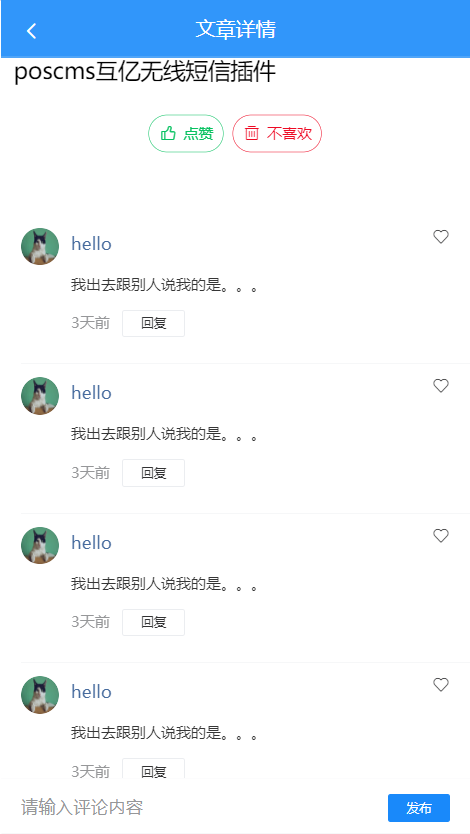

### 获取数据并展示

> 提示：有评论数据的文章 id：`139987`。

步骤：

- 封装接口
- 请求获取数据
- 处理模板

实现：

1、在 `api/comment.js` 中添加封装请求方法

```js
/**
 * 评论接口模块
 */
import request from "@/utils/request";

/**
 * 获取文章列表
 */
export function getComments(params) {
  return request({
    method: "GET",
    url: "/app/v1_0/comments",
    params,
  });
}
```

2、请求获取数据

```js
data () {
  return {
    ...
    articleComment: { // 文章评论相关数据
      list: [],
      loading: false,
      finished: false,
      offset: null, // 请求下一页数据的页码
      totalCount: 0 // 总数据条数
    }
  }
}
```

```js
async onLoad () {
  const articleComment = this.articleComment
  // 1. 请求获取数据
  const { data } = await getComments({
    type: 'a', // 评论类型，a-对文章(article)的评论，c-对评论(comment)的回复
    source: this.articleId, // 源id，文章id或评论id
    offset: articleComment.offset, // 获取评论数据的偏移量，值为评论id，表示从此id的数据向后取，不传表示从第一页开始读取数据
    limit: 10 // 每页大小
  })

  // 2. 将数据添加到列表中
  const { results } = data.data
  articleComment.list.push(...results)

  // 更新总数据条数
  articleComment.totalCount = data.data.total_count

  // 3. 将加载更多的 loading 设置为 false
  articleComment.loading = false

  // 4. 判断是否还有数据
  if (results.length) {
    articleComment.offset = data.data.last_id // 更新获取下一页数据的页码
  } else {
    articleComment.finished = true // 没有数据了，关闭加载更多
  }
}
```

3、模板绑定

```html
<!-- 评论列表 -->
<van-list
  v-model="loading"
  :finished="finished"
  finished-text="没有更多了"
  @load="onLoad"
>
  <van-cell v-for="item in list" + :key="item.com_id.toString()">
    <van-image
      slot="icon"
      round
      width="30"
      height="30"
      style="margin-right: 10px;"
      +
      :src="item.aut_photo"
    />
    + <span style="color: #466b9d;" slot="title">{{ item.aut_name }}</span>
    <div slot="label">
      +
      <p style="color: #363636;">{{ item.content }}</p>
      <p>
        +
        <span style="margin-right: 10px;"
          >{{ item.pubdate | relativeTime }}</span
        >
        <van-button size="mini" type="default">回复</van-button>
      </p>
    </div>
    <van-icon slot="right-icon" name="like-o" />
  </van-cell>
</van-list>
<!-- 评论列表 -->
```

### 展示文章评论总数量

### 文章评论项

```html
<template>
  <van-cell class="comment-item">
    <van-image
      slot="icon"
      class="avatar"
      round
      fit="cover"
      src="https://img.yzcdn.cn/vant/cat.jpeg"
    />
    <div slot="title" class="title-wrap">
      <div class="user-name">用户名称</div>
      <van-button class="like-btn" icon="good-job-o">赞</van-button>
    </div>

    <div slot="label">
      <p class="comment-content">这是评论内容</p>
      <div class="bottom-info">
        <span class="comment-pubdate">4天前</span>
        <van-button class="reply-btn" round>回复 0</van-button>
      </div>
    </div>
  </van-cell>
</template>

<script>
  export default {
    name: "CommentItem",
    components: {},
    props: {},
    data() {
      return {};
    },
    computed: {},
    watch: {},
    created() {},
    mounted() {},
    methods: {},
  };
</script>

<style scoped lang="less">
  .comment-item {
    .avatar {
      width: 72px;
      height: 72px;
      margin-right: 25px;
    }
    .title-wrap {
      display: flex;
      justify-content: space-between;
      align-items: center;
      .user-name {
        color: #406599;
        font-size: 26px;
      }
    }
    .comment-content {
      font-size: 32px;
      color: #222222;
      word-break: break-all;
      text-align: justify;
    }
    .comment-pubdate {
      font-size: 19px;
      color: #222;
      margin-right: 25px;
    }
    .bottom-info {
      display: flex;
      align-items: center;
    }
    .reply-btn {
      width: 135px;
      height: 48px;
      line-height: 48px;
      font-size: 21px;
      color: #222;
    }
    .like-btn {
      height: 30px;
      padding: 0;
      border: none;
      font-size: 19px;
      line-height: 30px;
      margin-right: 7px;
      .van-icon {
        font-size: 30px;
      }
    }
  }
</style>
```

绑定之后：

```html
<template>
  <van-cell class="comment-item">
    <van-image
      slot="icon"
      class="avatar"
      round
      fit="cover"
      :src="comment.aut_photo"
    />
    <div slot="title" class="title-wrap">
      <div class="user-name">{{ comment.aut_name }}</div>
      <van-button class="like-btn" icon="good-job-o"
        >{{ comment.like_count || '赞' }}</van-button
      >
    </div>

    <div slot="label">
      <p class="comment-content">{{ comment.content }}</p>
      <div class="bottom-info">
        <span class="comment-pubdate"
          >{{ comment.pubdate | relativeTime }}</span
        >
        <van-button class="reply-btn" round
          >回复 {{ comment.reply_count }}</van-button
        >
      </div>
    </div>
  </van-cell>
</template>

<script>
  export default {
    name: "CommentItem",
    components: {},
    props: {
      comment: {
        type: Object,
        required: true,
      },
    },
    data() {
      return {};
    },
    computed: {},
    watch: {},
    created() {},
    mounted() {},
    methods: {},
  };
</script>

<style scoped lang="less">
  .comment-item {
    .avatar {
      width: 72px;
      height: 72px;
      margin-right: 25px;
    }
    .title-wrap {
      display: flex;
      justify-content: space-between;
      align-items: center;
      .user-name {
        color: #406599;
        font-size: 26px;
      }
    }
    .comment-content {
      font-size: 32px;
      color: #222222;
      word-break: break-all;
      text-align: justify;
    }
    .comment-pubdate {
      font-size: 19px;
      color: #222;
      margin-right: 25px;
    }
    .bottom-info {
      display: flex;
      align-items: center;
    }
    .reply-btn {
      width: 135px;
      height: 48px;
      line-height: 48px;
      font-size: 21px;
      color: #222;
    }
    .like-btn {
      height: 30px;
      padding: 0;
      border: none;
      font-size: 19px;
      line-height: 30px;
      margin-right: 7px;
      .van-icon {
        font-size: 30px;
      }
    }
  }
</style>
```

## 评论点赞

1、在 `api/comment.js` 中添加封装两个数据接口

```js
/**
 * 对评论或评论回复点赞
 */
export function addCommentLike(commentId) {
  return request({
    method: "POST",
    url: "/app/v1_0/comment/likings",
    data: {
      target: commentId,
    },
  });
}

/**
 * 取消对评论或评论回复点赞
 */
export function deleteCommentLike(commentId) {
  return request({
    method: "DELETE",
    url: `/app/v1_0/comment/likings/${commentId}`,
  });
}
```

2、然后给评论项中的 `like` 图标注册点击事件

```html
<van-icon
  slot="right-icon"
  color="red"
  +
  :name="item.is_liking ? 'like' : 'like-o'"
  +
  @click="onCommentLike(item)"
/>
```

3、在事件处理函数中

```js
import {
  getComments,
  addComment,
+  addCommentLike,
+  deleteCommentLike
} from '@/api/comment'
```

```js
async onCommentLike (comment) {
  // 如果已经赞了则取消点赞
  if (comment.is_liking) {
    await deleteCommentLike(comment.com_id)
  } else {
    // 如果没有赞，则点赞
    await addCommentLike(comment.com_id)
  }

  // 更新视图状态
  comment.is_liking = !comment.is_liking
  this.$toast('操作成功')
}
```

## 发布文章评论

### 准备弹出层

### 封装组件

```html
<template>
  <div class="comment-post">
    <van-field
      class="post-field"
      v-model="message"
      rows="2"
      autosize
      type="textarea"
      maxlength="50"
      placeholder="请输入留言"
      show-word-limit
    />
    <van-button class="post-btn">发布</van-button>
  </div>
</template>

<script>
  export default {
    name: "CommentPost",
    components: {},
    props: {},
    data() {
      return {
        message: "",
      };
    },
    computed: {},
    watch: {},
    created() {},
    mounted() {},
    methods: {},
  };
</script>

<style scoped lang="less">
  .comment-post {
    display: flex;
    align-items: center;
    padding: 32px 0 32px 32px;
    .post-field {
      background-color: #f5f7f9;
    }
    .post-btn {
      width: 150px;
      border: none;
      padding: 0;
      color: #6ba3d8;
      &::before {
        display: none;
      }
    }
  }
</style>
```

步骤：

- 注册发布点击事件
- 请求提交表单
- 根据响应结果进行后续处理

一、使用弹层展示发布评论

1、添加弹层组件

```js
data () {
  return {
    ...
    isPostShow: false
  }
}
```

```html
<!-- 发布文章评论 -->
<van-popup v-model="isPostShow" position="bottom" />
<!-- /发布文章评论 -->
```

> 提示：不设置高度的时候，内容会自动撑开弹层高度

2、点击发评论按钮的时候显示弹层

```html
<van-button
  class="write-btn"
  type="default"
  round
  size="small"
  @click="isPostShow = true"
  >写评论</van-button
>
```

二、封装发布评论组件

1、创建 `post-comment.vue`

```html
<template>
  <div class="post-comment">
    <van-field
      class="post-field"
      v-model="message"
      rows="2"
      autosize
      type="textarea"
      maxlength="50"
      placeholder="优质评论将会被优先展示"
      show-word-limit
    />
    <van-button type="primary" size="small">发布</van-button>
  </div>
</template>

<script>
  export default {
    name: "PostComment",
    components: {},
    props: {},
    data() {
      return {
        message: "",
      };
    },
    computed: {},
    watch: {},
    created() {},
    mounted() {},
    methods: {},
  };
</script>

<style scoped lang="less">
  .post-comment {
    display: flex;
    padding: 15px;
    align-items: flex-end;
    .post-field {
      background: #f5f7f9;
      margin-right: 15px;
    }
  }
</style>
```

2、在详情页加载注册

3、在发布评论的弹层中使用

```html
<!-- 发布文章评论 -->
<van-popup v-model="isPostShow" position="bottom">
  <post-comment />
</van-popup>
<!-- /发布文章评论 -->
```

三、发布评论

1、在 `api/comment.js` 中添加封装数据接口

```js
/**
 * 添加评论或评论回复
 */
export function addComment(data) {
  return request({
    method: "POST",
    url: "/app/v1_0/comments",
    data,
  });
}
```

2、绑定获取添加评论的输入框数据并且注册发布按钮的点击事件

```js
data () {
  return {
    ...
    inputComment: ''
  }
}
```

```html
<!-- 发布评论 -->
<van-cell-group class="publish-wrap">
  <van-field + v-model="inputComment" clearable placeholder="请输入评论内容">
    <van-button slot="button" size="mini" type="info" + @click="onAddComment"
      >发布</van-button
    >
  </van-field>
</van-cell-group>
<!-- /发布评论 -->
```

3、在事件处理函数中

```js
import {
	getComments,
+  addComment
} from '@/api/comment'
```

```js
async onAddComment () {
  const inputComment = this.inputComment.trim()

  // 非空校验
  if (!inputComment.length) {
    return
  }

  // 请求添加
  const res = await addComment({
    target: this.$route.params.articleId, // 评论的目标id（评论文章即为文章id，对评论进行回复则为评论id）
    content: inputComment // 评论内容
    // art_id // 文章id，对评论内容发表回复时，需要传递此参数，表明所属文章id。对文章进行评论，不要传此参数。
  })

  // 将发布的最新评论展示到列表顶部
  this.list.unshift(res.data.data.new_obj)

  // 清空文本框
  this.inputComment = ''
}
```

### 请求发布

基本思路：

- 找到数据接口
- 封装请求方法
- 注册发布点击事件
  - 请求发布
  - 成功：将发布的内容展示到列表中
  - 失败：提示失败

1、封装数据接口

```js
/**
 * 发布评论
 */
export const addComment = (data) => {
  return request({
    method: "POST",
    url: "/app/v1_0/comments",
    data,
  });
};
```

2、给发布按钮点击事件

3、事件处理函数

```js
async onAddComment () {
  // 1. 拿到数据
  const postMessage = this.postMessage

  // 非空校验
  if (!postMessage) {
    return
  }

  this.$toast.loading({
    duration: 0, // 持续展示 toast
    message: '发布中...',
    forbidClick: true // 是否禁止背景点击
  })

  try {
    // 2. 请求提交
    const { data } = await addComment({
      target: this.articleId, // 评论的目标id（评论文章即为文章id，对评论进行回复则为评论id）
      content: postMessage
      // art_id: // 文章id，对评论内容发表回复时，需要传递此参数，表明所属文章id。对文章进行评论，不要传此参数。
    })

    // 关闭发布评论的弹层
    this.isPostShow = false

    // 将最新发布的评论展示到列表的顶部
    this.articleComment.list.unshift(data.data.new_obj)

    // 更新文章评论的总数量
    this.articleComment.totalCount++

    // 清空文本框
    this.postMessage = ''

    this.$toast.success('发布成功')
  } catch (err) {
    console.log(err)
    this.$toast.fail('发布失败')
  }
}
```

### 发布成功处理

## 评论回复

### 准备回复弹层

一、在详情页中使用弹层用来展示文章的回复

1、在 data 中添加数据用来控制展示回复弹层的显示状态

```js
data () {
  return {
    ...
    isReplyShow: false
  }
}
```

2、在详情页中添加使用弹层组件

```html
<!-- 评论回复 -->
<van-popup v-model="isReplyShow" position="bottom" style="height: 95%">
  评论回复
</van-popup>
<!-- /评论回复 -->
```

二、当点击评论项组件中的回复按钮的时候展示弹层

1、在 `comment-item.vue` 组件中点击回复按钮的时候，对外发布自定义事件

```php+HTML
<van-button
  size="mini"
  type="default"
  @click="$emit('click-reply')"
>回复 {{ comment.reply_count }}</van-button>
```

2、在详情页组件中使用的位置监听处理

```html
<comment-item
  v-for="(comment, index) in articleComment.list"
  :key="index"
  :comment="comment"
  @click-reply="isReplyShow = true"
/>
```

### 点击回复显示弹出层

### 封装内容组件

```html
<template>
  <div class="comment-reply">
    <!-- 导航栏 -->
    <van-nav-bar :title="`${comment.reply_count}条回复`">
      <van-icon slot="left" name="cross" @click="$emit('click-close')" />
    </van-nav-bar>
    <!-- /导航栏 -->

    <!-- 当前评论项 -->
    <!-- /当前评论项 -->

    <van-cell title="所有回复" />

    <!-- 评论的回复列表 -->
    <!-- /评论的回复列表 -->

    <!-- 底部 -->
    <!-- /底部 -->
  </div>
</template>

<script>
  export default {
    name: "CommentReply",
    components: {},
    props: {},
    data() {
      return {};
    },
    computed: {},
    watch: {},
    created() {},
    mounted() {},
    methods: {},
  };
</script>

<style scoped></style>
```

### 传递当前点击回复的评论项

### 处理头部

### 处理当前评论项

一、让 `comment-reply.vue` 组件拿到点击回复的评论对象

1、在 `comment-item.vue` 组件中点击回复按钮的时候把评论对象给传出来

```html
<van-button size="mini" type="default" @click="$emit('click-reply', comment)"
  >回复 {{ comment.reply_count }}</van-button
>
```

2、在文章详情组件中接收处理

```js
data () {
  return {
    ...
    currentComment: {} // 点击回复的那个评论对象
  }
}
```

```html
<comment-item
  v-for="(comment, index) in articleComment.list"
  :key="index"
  :comment="comment"
  @click-reply="onReplyShow"
/>
```

```js
async onReplyShow (comment) {
  // 将子组件中传给我评论对象存储到当前组件
  this.currentComment = comment

  // 展示评论回复弹层
  this.isReplyShow = true
}
```

3、在详情组件中将 `currentComment` 传递给 `comment-reply.vue` 组件

```html
<!-- 评论回复 -->
<van-popup v-model="isReplyShow" position="bottom" style="height: 95%">
  <comment-reply @click-close="isReplyShow = false" :comment="currentComment" />
</van-popup>
<!-- /评论回复 -->
```

4、在 `comment-reply.vue` 组件中声明接收

```js
props: {
  comment: {
    type: Object,
    required: true
  }
},
```

最后使用调试工具查看 props 数据是否接收正确。

二、在 `comment-reply.vue` 组件中展示当前评论

1、加载注册 `comment-item.vue` 组件

2、使用展示

```html
<template>
  <div class="comment-reply">
    <!-- 导航栏 -->
    <van-nav-bar :title="`${comment.reply_count}条回复`">
      <van-icon slot="left" name="cross" @click="$emit('click-close')" />
    </van-nav-bar>
    <!-- /导航栏 -->

    <!-- 当前评论项 -->
    <comment-item :comment="comment" />
    <!-- /当前评论项 -->

    <!-- 评论的回复列表 -->
    <!-- /评论的回复列表 -->

    <!-- 底部 -->
    <!-- /底部 -->
  </div>
</template>
```

一：把点击回复的评论对象传递给评论回复组件

1、在 data 中添加一个数据用来存储点击回复的评论对象

```js
data () {
  return {
    ...
    currentComment: {} // 存储当前点击回复的评论对象
  }
}
```

2、在点击回复的处理函数中评论对象存储到数据中

```js
async onReplyShow (comment) {
+  this.currentComment = comment
  // 显示回复的弹层
  this.isReplyShow = true
}
```

3、把当前组件的 `currentComment` 传递给评论回复组件

```html
<!-- 评论回复 -->
<van-popup
  v-model="isReplyShow"
  get-container="body"
  round
  position="bottom"
  :style="{ height: '90%' }"
>
  <!-- 回复列表 -->
  + <comment-reply :comment="currentComment" />
  <!-- /回复列表 -->
</van-popup>
<!-- 评论回复 -->
```

4、在评论回复组件中声明 `props` 接收数据

```js
props: {
  comment: {
    type: Object,
    required: true
  }
},
```

测试：点击不同的评论回复按钮，查看子组件中的 props 数据 `comment` 是否是当前点击回复所在的评论对象。

二、数据绑定：在评论回复组件中展示当前评论

```html
<!-- 导航栏 -->
+
<van-nav-bar :title="comment.reply_count + '条回复'">
  <van-icon slot="left" name="cross" />
</van-nav-bar>
<!-- /导航栏 -->

<!-- 当前评论 -->
<van-cell title="当前评论">
  <van-image
    slot="icon"
    round
    width="30"
    height="30"
    style="margin-right: 10px;"
    :src="comment.aut_photo"
  />
  + <span style="color: #466b9d;" slot="title">{{ comment.aut_name }}</span>
  <div slot="label">
    +
    <p style="color: #363636;">{{ comment.content }}</p>
    <p>
      +
      <span style="margin-right: 10px;"
        >{{ comment.pubdate | relativeTime }}</span
      >
      <van-button size="mini" type="default" +
        >回复 {{ comment.reply_count }}</van-button
      >
    </p>
  </div>
  <van-icon slot="right-icon" />
</van-cell>
<!-- /当前评论 -->
```

### 展示评论回复列表

基本思路：

- 回复列表和文章的评论列表几乎是一样的
- 重用把之前封装的评论列表

```html
<template>
  <div class="comment-reply">
    <!-- 导航栏 -->
    <van-nav-bar :title="`${comment.reply_count}条回复`">
      <van-icon slot="left" name="cross" @click="$emit('click-close')" />
    </van-nav-bar>
    <!-- /导航栏 -->

    <!-- 当前评论项 -->
    <comment-item :comment="comment" />
    <!-- /当前评论项 -->

    <van-cell title="所有回复" />

    <!-- 评论的回复列表 -->
    <van-list
      v-model="loading"
      :finished="finished"
      finished-text="没有更多了"
      @load="onLoad"
    >
      <comment-item
        v-for="(comment, index) in list"
        :key="index"
        :comment="comment"
      />
    </van-list>
    <!-- /评论的回复列表 -->

    <!-- 底部 -->
    <!-- /底部 -->
  </div>
</template>

<script>
  import CommentItem from "./comment-item";
  import { getComments } from "@/api/comment";

  export default {
    name: "CommentReply",
    components: {
      CommentItem,
    },
    props: {
      comment: {
        type: Object,
        required: true,
      },
    },
    data() {
      return {
        list: [],
        loading: false,
        finished: false,
        offset: null,
        limit: 20,
      };
    },
    computed: {},
    watch: {},
    created() {},
    mounted() {},
    methods: {
      async onLoad() {
        // 1. 请求获取数据
        const { data } = await getComments({
          type: "c", // 评论类型，a-对文章(article)的评论，c-对评论(comment)的回复
          source: this.comment.com_id.toString(), // 源id，文章id或评论id
          offset: this.offset, // 获取评论数据的偏移量，值为评论id，表示从此id的数据向后取，不传表示从第一页开始读取数据
          limit: this.limit, // 获取的评论数据个数，不传表示采用后端服务设定的默认每页数据量
        });

        // 2. 将数据添加到列表中
        const { results } = data.data;
        this.list.push(...results);

        // 3. 关闭 loading
        this.loading = false;

        // 4. 判断数据是否加载完毕
        if (results.length) {
          this.offset = data.data.last_id;
        } else {
          this.finished = true;
        }
      },
    },
  };
</script>

<style scoped></style>
```

### 解决弹层中组件内容不更新问题

弹层组件：

- 如果初始的条件是 false，则弹层的内容不会渲染
- 程序运行期间，当条件变为 true 的时候，弹层才渲染了内容
- 之后切换弹层的展示，弹层只是通过 CSS 控制隐藏和显示

弹层渲染出来以后就只是简单的切换显示和隐藏，里面的内容也不再重新渲染了，所以会导致我们的评论的回复列表不会动态更新了。解决办法就是在每次弹层显示的时候重新渲染组件。

```html
<!-- 评论回复 -->
<van-popup
  v-model="isReplyShow"
  get-container="body"
  round
  position="bottom"
  :style="{ height: '90%' }"
>
  <!-- 回复列表 -->
  <comment-reply :comment="currentComment" + v-if="isReplyShow" />
  <!-- /回复列表 -->
</van-popup>
<!-- 评论回复 -->
```

### 发布回复

# 九、用户页面

> 该模块作为学生作业，不讲解，仅供源码参考。


## 创建组件并配置路由

1、创建 `views/user/index.vue`

```html
<template>
  <div class="user-container">用户页面</div>
</template>

<script>
  export default {
    name: "UserPage",
    components: {},
    props: {},
    data() {
      return {};
    },
    computed: {},
    watch: {},
    created() {},
    mounted() {},
    methods: {},
  };
</script>

<style scoped></style>
```

2、配置到根路由

```js
{
  path: '/user/:userId',
  name: 'user',
  component: () => import('@/views/user')
}
```

最后访问 `/user/用户ID` 测试。

## 页面布局

```html
<template>
  <div class="user-container">
    <!-- 导航栏 -->
    <van-nav-bar
      class="page-nav-bar"
      left-arrow
      title="用户名"
      @click-left="$router.back()"
    ></van-nav-bar>
    <!-- /导航栏 -->

    <div class="user-info">
      <div class="base-info">
        <van-image
          class="avatar"
          round
          fit="cover"
          src="https://img.yzcdn.cn/vant/cat.jpeg"
        />
        <div class="right-area">
          <div class="stats-wrap">
            <div class="stats-item">
              <span class="count">66</span>
              <span class="text">发布</span>
            </div>
            <div class="stats-item">
              <span class="count">88</span>
              <span class="text">关注</span>
            </div>
            <div class="stats-item">
              <span class="count">28</span>
              <span class="text">粉丝</span>
            </div>
            <div class="stats-item">
              <span class="count">160</span>
              <span class="text">获赞</span>
            </div>
          </div>
          <van-button class="follow-btn">关注</van-button>
        </div>
      </div>
      <div class="label-info">
        <div class="bio-wrap">
          <span class="label">简介：</span>
          <span class="text">这是用户简介</span>
        </div>
      </div>
    </div>
  </div>
</template>

<script>
  export default {
    name: "UserIndex",
    components: {},
    props: {
      userId: {
        type: [Number, String, Object],
        required: true,
      },
    },
    data() {
      return {};
    },
    computed: {},
    watch: {},
    created() {},
    mounted() {},
    methods: {},
  };
</script>

<style scoped lang="less">
  .user-container {
    .user-info {
      background-color: #fff;
      padding: 25px 32px;
      .base-info {
        display: flex;
        margin-bottom: 25px;
        .avatar {
          width: 155px;
          height: 155px;
          margin-right: 62px;
        }
      }
      .label-info {
        font-size: 25px;
        .bio-wrap {
          .label {
            color: #646263;
          }
          .text {
            color: #212121;
          }
        }
      }
    }
    .right-area {
      flex: 1;
      display: flex;
      flex-direction: column;
      justify-content: space-evenly;
      .stats-wrap {
        display: flex;
        justify-content: space-between;
        .stats-item {
          display: flex;
          flex-direction: column;
          justify-content: center;
          align-items: center;
          .count {
            font-size: 26px;
            color: #0d0a10;
          }
          .text {
            font-size: 21px;
            color: #9c9b9d;
          }
        }
      }
      .follow-btn {
        width: 289px;
        height: 55px;
        line-height: 55px;
        background-color: #6bb5ff;
        color: #fff;
        border: none;
      }
    }
  }
</style>
```

```html
<template>
  <div class="user-container">
    <!-- 导航栏 -->
    <van-nav-bar title="黑马头条号" left-arrow />
    <!-- /导航栏 -->

    <!-- 用户信息 -->
    <div class="user-info-container">
      <div class="row1">
        <van-image
          class="col1"
          fit="cover"
          round
          src="https://img.yzcdn.cn/vant/cat.jpeg"
        />
        <div class="col2">
          <div class="row1">
            <div class="item">
              <div class="count">123</div>
              <div class="text">发布</div>
            </div>
            <div class="item">
              <div class="count">123</div>
              <div class="text">关注</div>
            </div>
            <div class="item">
              <div class="count">123</div>
              <div class="text">粉丝</div>
            </div>
            <div class="item">
              <div class="count">123</div>
              <div class="text">获赞</div>
            </div>
          </div>
          <div class="action">
            <van-button type="primary" size="small">私信</van-button>
            <van-button type="default" size="small">编辑资料</van-button>
          </div>
        </div>
      </div>
      <div class="intro-wrap">
        <div>
          <span>认证：</span>
          <span>用户的认证信息</span>
        </div>
        <div>
          <span>简介：</span>
          <span>用户的简介信息</span>
        </div>
      </div>
    </div>
    <!-- /用户信息 -->

    <!-- 文章列表 -->
    <!-- /文章列表 -->
  </div>
</template>

<script>
  export default {
    name: "UserPage",
    components: {},
    props: {},
    data() {
      return {};
    },
    computed: {},
    watch: {},
    created() {},
    mounted() {},
    methods: {},
  };
</script>

<style scoped lang="less">
  .user-container {
    font-size: 14px;
    .user-info-container {
      padding: 12px;
      background-color: #fff;
      margin-bottom: 10px;
      > .row1 {
        display: flex;
        justify-content: space-between;
        align-items: center;
        margin-bottom: 10px;
        .item {
          text-align: center;
          .text {
            font-size: 12px;
          }
        }
        > .col1 {
          width: 80px;
          height: 80px;
        }
        > .col2 {
          display: flex;
          flex-direction: column;
          justify-content: space-evenly;
          width: 70%;
          height: 80px;
          padding: 0 12px;
          > .row1 {
            display: flex;
            justify-content: space-between;
          }
          .action {
            display: flex;
            justify-content: space-between;
            .van-button {
              width: 45%;
            }
          }
        }
      }
    }
  }
</style>
```

## 展示用户信息

步骤：

- 封装数据接口
- 请求获取数据
- 模板绑定

1、在 `api/user.js` 中添加获取指定用户信息的数据接口

```js
// 获取指定用户信息
export const getUserById = (userId) => {
  return request({
    method: "GET",
    url: `/app/v1_0/users/${userId}`,
  });
};
```

2、在用户页面中请求获取数据

```js
+ import { getUserById } from '@/api/user'

export default {
  name: 'UserPage',
  components: {},
  props: {},
  data () {
    return {
+      user: {} // 用户信息
    }
  },
  computed: {},
  watch: {},
  created () {
+    this.loadUser()
  },
  mounted () {},
  methods: {
+++    async loadUser () {
      try {
        const { data } = await getUserById(this.$route.params.userId)
        this.user = data.data
      } catch (err) {
        console.log(err)
        this.$toast('获取用户数据失败')
      }
    }
  }
}
```

3、模板绑定

## 用户关注

## 展示用户文章列表

### 列表组件

```
<van-list
  v-model="loading"
  :finished="finished"
  finished-text="没有更多了"
  @load="onLoad"
>
  <van-cell
    v-for="item in list"
    :key="item"
    :title="item"
  />
</van-list>
export default {
  data() {
    return {
      list: [],
      loading: false,
      finished: false
    };
  },

  methods: {
    onLoad() {
      // 异步更新数据
      setTimeout(() => {
        for (let i = 0; i < 10; i++) {
          this.list.push(this.list.length + 1);
        }
        // 加载状态结束
        this.loading = false;

        // 数据全部加载完成
        if (this.list.length >= 40) {
          this.finished = true;
        }
      }, 500);
    }
  }
}
```

### 分析列表组件使用

List 的运行机制是什么？

```
List 会监听浏览器的滚动事件并计算列表的位置，当列表底部与可视区域的距离小于offset时，List 会触发一次 load 事件。
```

为什么 List 初始化后会立即触发 load 事件？

```
List 初始化后会触发一次 load 事件，用于加载第一屏的数据，这个特性可以通过`immediate-check`属性关闭。
```

为什么会连续触发 load 事件？

```
如果一次请求加载的数据条数较少，导致列表内容无法铺满当前屏幕，List 会继续触发 load 事件，直到内容铺满屏幕或数据全部加载完成。因此你需要调整每次获取的数据条数，理想情况下每次请求获取的数据条数应能够填满一屏高度。
```

loading 和 finished 分别是什么含义？

> `List`有以下三种状态，理解这些状态有助于你正确地使用`List`组件：
>
> - 非加载中，`loading`为`false`，此时会根据列表滚动位置判断是否触发`load`事件（列表内容不足一屏幕时，会直接触发）
> - 加载中，`loading`为`true`，表示正在发送异步请求，此时不会触发`load`事件
> - 加载完成，`finished`为`true`，此时不会触发`load`事件
>
> 在每次请求完毕后，需要手动将`loading`设置为`false`，表示本次 load 加载结束

使用 float 布局后一直触发加载？

```
若 List 的内容使用了 float 布局，可以在容器上添加van-clearfix类名来清除浮动，使得 List 能正确判断元素位置
```

### 展示文章列表

1、封装获取用户文章列表的数据接口

```js
/**
 * 获取指定用户的文章列表
 */
export const getArticlesByUser = (userId, params) => {
  return request({
    method: "GET",
    url: `/app/v1_0/users/${userId}/articles`,
    params,
  });
};
```

2、在用户页面中请求获取数据

```js
import { getUserById } from '@/api/user'
+ import { getArticlesByUser } from '@/api/article'

export default {
  name: 'UserPage',
  components: {},
  props: {},
  data () {
    return {
      user: {}, // 用户信息
      list: [], // 列表数据
      loading: false, // 控制上拉加载更多的 loading
      finished: false, // 控制是否加载结束了
+      page: 1 // 获取下一页数据的页码
    }
  },
  computed: {},
  watch: {},
  created () {
    this.loadUser()
  },
  mounted () {},
  methods: {
    async loadUser () {
      try {
        const { data } = await getUserById(this.$route.params.userId)
        this.user = data.data
      } catch (err) {
        console.log(err)
        this.$toast('获取用户数据失败')
      }
    },

+++    async onLoad () {
      // 1. 请求获取数据
      const { data } = await getArticlesByUser(this.$route.params.userId, {
        page: this.page, // 可选的，默认是第 1 页
        per_page: 20 // 可选的，默认每页 10 条
      })

      // 2. 把数据添加到列表中
      // list []
      // data.data.results []
      // ...[1, 2, 3] 会把数组给展开，所谓的展开就是一个一个的拿出来
      const { results } = data.data
      this.list.push(...results)

      // 3. 加载状态结束
      this.loading = false

      // 4. 判断数据是否全部加载完毕
      if (results.length) {
        this.page++ // 更新获取下一页数据的页码
      } else {
        this.finished = true // 没有数据了，不需要加载更多了
      }
    }
  }
}
```

# 十二、编辑用户资料


## 创建组件并配置路由

1、创建 `views/user/index.vue`

```html
<template>
  <div>
    <van-nav-bar title="个人信息" left-arrow right-text="保存" />
    <van-cell-group>
      <van-cell title="头像" is-link>
        <van-image
          round
          width="30"
          height="30"
          fit="cover"
          src="http://toutiao.meiduo.site/FgSTA3msGyxp5-Oufnm5c0kjVgW7"
        />
      </van-cell>
      <van-cell title="昵称" value="abc" is-link />
      <van-cell title="性别" value="男" is-link />
      <van-cell title="生日" value="2019-9-27" is-link />
    </van-cell-group>
  </div>
</template>

<script>
  export default {
    name: "UserIndex",
  };
</script>
```

2、将该页面配置到根路由

```js
{
  name: 'user-profile',
  path: '/user/profile',
  component: () => import('@/views/user-profile')
}
```

## 页面布局

```html
<template>
  <div class="user-profile">
    <!-- 导航栏 -->
    <van-nav-bar
      class="page-nav-bar"
      title="个人信息"
      left-arrow
      @click-left="$router.back()"
    />
    <!-- /导航栏 -->

    <!-- 个人信息 -->
    <van-cell class="avatar-cell" title="头像" is-link center>
      <van-image
        class="avatar"
        round
        fit="cover"
        src="https://img.yzcdn.cn/vant/cat.jpeg"
      />
    </van-cell>
    <van-cell title="昵称" value="内容" is-link />
    <van-cell title="性别" value="内容" is-link />
    <van-cell title="生日" value="内容" is-link />
    <!-- /个人信息 -->
  </div>
</template>

<script>
  export default {
    name: "UserProfile",
    components: {},
    props: {},
    data() {
      return {};
    },
    computed: {},
    watch: {},
    created() {},
    mounted() {},
    methods: {},
  };
</script>

<style scoped lang="less">
  .user-profile {
    .avatar-cell {
      .van-cell__value {
        display: flex;
        flex-direction: row-reverse;
      }
      .avatar {
        width: 60px;
        height: 60px;
      }
    }
  }
</style>
```

## 展示用户信息

思路：

- 找到数据接口
- 封装请求方法
- 请求获取数据
- 模板绑定

1、在 `api/user.js` 中添加封装数据接口

```js

```

2、在 `views/user/index.vue` 组件中请求获取数据

```js

```

3、模板绑定

## 修改昵称

一、准备弹出层

二、封装组件

三、页面布局

四、基本功能处理

五、更新完成

## 修改性别

## 修改生日

## 修改头像

### 图片上传预览

方式一：结合服务器的图片上传预览


方式二：纯客户端实现上传图片预览

```js
// 获取文文件对象
const file = fileInput.files[0];

// 设置图片的 src
img.src = window.URL.createObjectURL(file);
```

客户端上传预览示例：

```html
<!DOCTYPE html>
<html lang="en">
  <head>
    <meta charset="UTF-8" />
    <title>客户端图片上传预览示例</title>
    <style>
      .img-wrap {
        width: 200px;
        height: 200px;
        border: 1px solid #ccc;
      }

      img {
        max-width: 100%;
      }
    </style>
  </head>
  <body>
    <h1>客户端图片上传预览示例</h1>
    <div class="img-wrap">
      
    </div>
    <br />
    <input type="file" id="file" onchange="onFileChange()" />
    <script>
      const img = document.querySelector("#img");
      const file = document.querySelector("#file");

      function onFileChange() {
        // 得到 file-input 的文件对象
        const fileObj = file.files[0];
        const data = window.URL.createObjectURL(fileObj);
        img.src = data;
      }
    </script>
  </body>
</html>
```

接下来就是在项目中使用纯客户端的方式处理用户头像上传预览。

在 `views/user/index.vue` 组件中：

```html
<template>
  <div>
    <van-nav-bar title="个人信息" left-arrow right-text="保存" />
    <van-cell-group>
      +
      <van-cell title="头像" is-link @click="onChangePhoto">
        <van-image round width="30" height="30" :src="user.photo" />
      </van-cell>
      <van-cell title="昵称" :value="user.name" is-link />
      <van-cell title="性别" :value="user.gender === 0 ? '男' : '女'" is-link />
      <van-cell title="生日" :value="user.birthday" is-link />
    </van-cell-group>

    <!--
      表单元素的 hidden 表示隐藏这个表单元素
     -->
    + <input type="file" hidden ref="file" @change="onFileChange" />
  </div>
</template>

<script>
  import { getProfile } from '@/api/user'

  export default {
    name: 'UserIndex',
    data () {
      return {
        user: {}
      }
    },

    created () {
      this.loadUserProfile()
    },

    methods: {
      async loadUserProfile () {
        const { data } = await getProfile()
        this.user = data.data
      },

  +    onChangePhoto () {
        this.$refs.file.click()
      },

  +    onFileChange () {
        this.user.photo = window.URL.createObjectURL(this.$refs.file.files[0])
      }
    }
  }
</script>
```

### 头像裁切

方案一：结合服务端的图片裁切上传流程

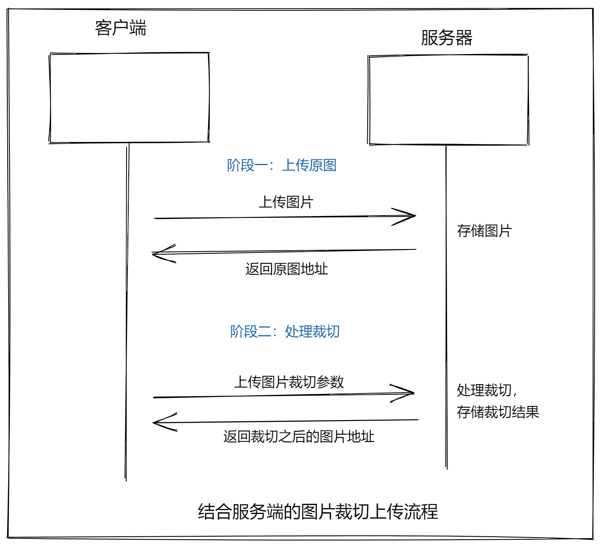

方案二：纯客户端的图片裁切上传流程

- [\<input type="file"\>](https://developer.mozilla.org/zh-CN/docs/Web/HTML/Element/Input/file)
- [在 web 应用程序中使用文件](https://developer.mozilla.org/zh-CN/docs/Web/API/File/Using_files_from_web_applications)

```
viewMode: 1,
dragMode: 'move',
aspectRatio: 1,
autoCropArea: 1,
cropBoxMovable: false,
cropBoxResizable: false,
background: false,
movable: true
```

### 保存更新

如果是基于服务端的裁切，则使用：[getData](https://github.com/fengyuanchen/cropperjs#getdatarounded) 方法，该方法得到裁切的区域参数。

如果是纯客户端的图片裁切，则使用：[getCroppedCanvas](https://github.com/fengyuanchen/cropperjs#getcroppedcanvasoptions) 方法，该方法得到裁切之后的图片对象（类似于 URL.createObjectURL 方法得到的文件对象）。

步骤：

- 封装接口
- 请求提交
- 更新视图

1、在 `api/user.js` 中添加封装数据接口

```js
/**
 * 1、接口重用
 * 2、接口维护
 * 实际开发过程中，接口经常容易变化，
 * 你能记住你在哪里请求了这个接口吗？很难记住
 * 怎么办呢？
 *  我们单独的把接口请求的代码封装起来，统一的放到一起。
 * 放到哪里呢？
 *  我们放到项目的 api 目录中，
 *  根据接口的种类进行归类管理
 *  例如用户相关的接口放到 user.js 中
 *      文章相关的接口放到 article.js 中
 * 如何封装呢？
 *  一个函数，接收参数，返回请求结果就可以了。
 * 用户接口相关请求模块
 */
import request from '@/utils/request'

/**
* 登录
*/
export function login (user) {
  return request({
    // method 用来指定请求方法，这是 axios 的固定 API，不能瞎写
    method: 'POST',
    // url 用来指定请求路径
    url: '/app/v1_0/authorizations',
    // data 是 axios 请求要求的字段名，用来传递请求体数据的
    data: user
  })
}

/**
 * 关注用户
 */
export function followUser (userId) {
  return request({
    method: 'POST',
    url: '/app/v1_0/user/followings',
    data: {
      target: userId // 用户id
    }
  })
}

/**
 * 取消关注用户
 */
export function unFollowUser (userId) {
  return request({
    method: 'DELETE',
    url: '/app/v1_0/user/followings/' + userId
  })
}

/**
 * 获取用户自己信息
 */
export function getSelf (userId) {
  return request({
    method: 'GET',
    url: '/app/v1_0/user'
  })
}

/**
 * 获取用户个人资料
 */
export function getProfile (userId) {
  return request({
    method: 'GET',
    url: '/app/v1_0/user/profile'
  })
}

/**
 * 更新用户头像
 */
+ export function updateUserPhoto (data) {
  return request({
    method: 'PATCH',
    url: '/app/v1_0/user/photo',
    data
  })
}

```

2、在 `views/user/index.vue` 组件中保存提交

```html
<template>
  <div>
    <van-nav-bar
      title="个人信息"
      left-arrow
      right-text="保存"
      +
      @click-right="onSave"
    />
    <van-cell-group>
      <van-cell title="头像" is-link @click="onChangePhoto">
        <van-image round width="30" height="30" :src="user.photo" />
      </van-cell>
      <van-cell title="昵称" :value="user.name" is-link />
      <van-cell title="性别" :value="user.gender === 0 ? '男' : '女'" is-link />
      <van-cell title="生日" :value="user.birthday" is-link />
    </van-cell-group>

    <!--
      表单元素的 hidden 表示隐藏这个表单元素
     -->
    <input type="file" hidden ref="file" @change="onFileChange" />
  </div>
</template>

<script>
  + import { getProfile, updateUserPhoto } from '@/api/user'

  export default {
    name: 'UserIndex',
    data () {
      return {
        user: {}
      }
    },

    created () {
      this.loadUserProfile()
    },

    methods: {
      async loadUserProfile () {
        const { data } = await getProfile()
        this.user = data.data
      },

      onChangePhoto () {
        this.$refs.file.click()
      },

      onFileChange () {
        const fileObj = this.$refs.file.files[0]
        if (fileObj) {
          this.user.photo = window.URL.createObjectURL(fileObj)
        }
      },

  +    async onSave () {
        // 如果 Content-Type 要求是	application/json	，则 data 传普通对象 {}
        // 如果 Content-Type 要求是	multipart/form-data	，则 data 传 FormData 对象
        // 纵观所有数据接口，你会发现大多数的接口都要求 Content-Type 要求是	application/json
        // 一般只有涉及到文件上传的数据接口才要求Content-Type 要求是	multipart/form-data
        // 这个时候传递一个 FormData 对象
        this.$toast.loading({
          duration: 0, // 持续展示 toast
          forbidClick: true, // 禁用背景点击
          loadingType: 'spinner',
          message: '保存中'
        })

        try {
          const formData = new FormData()
          // formData.append('名字', 数据)
          formData.append('photo', this.$refs.file.files[0])
          await updateUserPhoto(formData)
          this.$toast.success('保存成功')
        } catch (err) {
          console.log(err)
          this.$toast.fail('保存失败')
        }
      }
    }
  }
</script>
```
